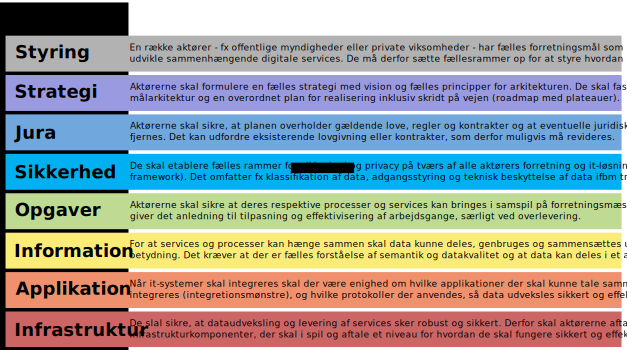
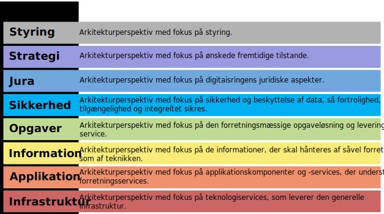
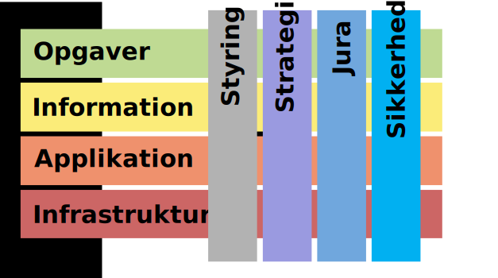
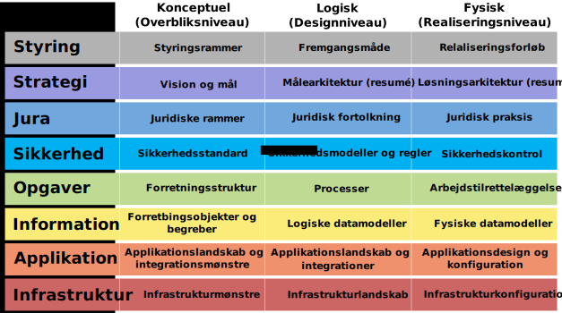
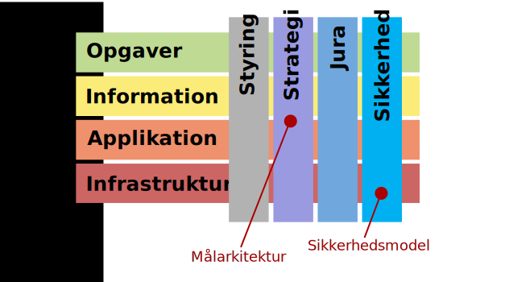
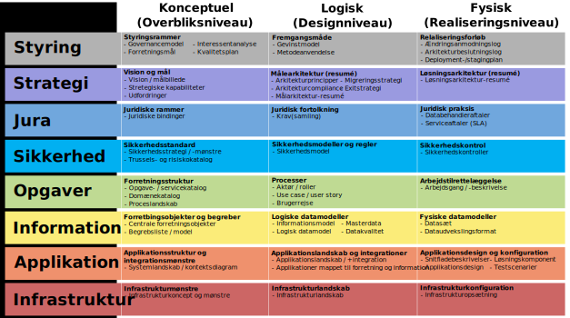
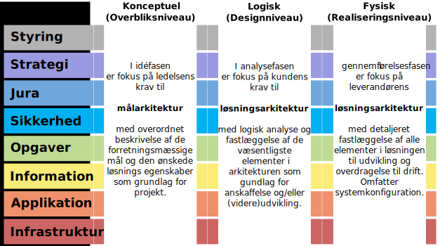

# Retningslinjer for formidling og dokumentation af arkitektur i digitaliseringsprojekter

## Indledning

Arkitektur er en central del af et digitaliseringsprojekt. Arkitektur har først og fremmest til formål at sikre et fornuftigt design af en given løsning i udviklingsforløbet. Dokumentation skal understøtte dialog mellem forretning og it, mellem kunde og leverandør og mellem projektets interessenter. Og en del af dokumentationen skal desuden understøtte den efterfølgende drift, vedligeholdelse og videreudvikling af løsningen

Dette dokument beskriver fællesoffentlige retningslinjer for dokumentation og formidling af arkitektur i digitaliseringsprojekter. Retningslinjerne understøtter princippet _Arkitektur styres på rette niveau efter fælles rammer_ og arkitekturregel 1.3 _Anvend fælles ramme for beskrivelse af arkitekturen_ i Hvidbog om fællesoffentlig digital arkitektur (FDA).

Retningslinjerne er udarbejdet med udgangspunkt i internationale standarder og best practice erfaringer fra danske myndigheder og deres leverandører.

### Formål

Formålet med disse retningslinjer er, at øge synligheden af arkitekturaspekter i forbindelse med digitalisering, så der kan samarbejdes om at opnå høj kvalitet med rette prioritering og så arkitekturen løbende kan anvendes og forbedres.

Retningslinjerne skal give en fælles ramme og terminologi for dokumentation af arkitekturen i digitaliseringsprojekter. Det er væsentligt nemmere at samarbejde og ”få stikkene til at passe sammen”, når arkitektur er beskrevet efter samme ramme.

Retningslinjerne skal kunne bruges uafhængigt af leverancemodel, projektmetode, systemudviklingsmetode og arkitekturværktøj.

Overordnet set skal retningslinjerne støtte projekter i, at udarbejde arkitekturdokumentation i form af to hovedleverancer:

* **Målarkitekturen**, der beskriver de overordnede mål og principper for den løsning, der skal udarbejdes, og lægger rammerne for fastlæggelsen af løsningsarkitekturen. Typisk fokus for kunden / ledelsen.
* **Løsningsarkitekturen**, der beskriver det detaljerede design af den løsning, der skal udvikles/er under udvikling/er udviklet. Typisk fokus for leverandøren.

Det er samtidig vigtigt at understrege, at der også skal være fokus på, at der produceres den fornødne dokumentation til, at de udviklede løsninger efterfølgende kan driftes, vedligeholdes og videreudvikles så effektivt som muligt. Og at der etableres den nødvendige governance til at understøtte dette.

Endelig skal retningslinjerne bidrage til, at der kan etableres overblik over system-/løsningsporteføljen, fx til brug for prioritering af kommende indsatser, jf. strategi for itstyring i staten.

### Målgruppe

Målgruppen for dette dokument er forretnings- og it-arkitekter samt projektledere hos myndigheder og deres leverandører med ansvar for at udarbejde dokumentation i offentlige digitaliseringsprojekter. 

### Anvendelse

Den fælles dokumentationsramme er nem at tage i brug og tilpasse til konkrete behov i et projekt/program og en myndighed/organisation. Retningslinjerne kan anvendes uafhængigt af projekt- og udviklingsmodel. Retningslinjerne er vejledende og kan frit anvendes af alle myndigheder. 

For projekter i regi af den fællesoffentlige digitaliseringsstrategi (FODS), er der aftalt krav om, at projekterne skal følge retningslinjerne med særligt fokus på at understøtte arkitekturstyring og kvalitetssikring gennem review.

Som led i FODS vil der blive etableret tilbud om kompetenceudvikling og rådgivning ift. anvendelse af disse retningslinjer, som stilles til rådighed for alle myndigheder og leverandører på markedsvilkår.

For statslige it-projekter gælder, at hvor der i forvejen er defineret produkter og fremgangsmåde i it-projektmodellen er dette gældende. Hvor retningslinjerne giver supplerende vejledning kan denne følges. 

#### Værdiskabelse

* Fælles retningslinjer bidrager til en digitalt sammenhængende sektor ved at understøtte hvidbogens principper og den fællesoffentlige rammearkitektur
* Arkitekturbeskrivelse skal ses som del af en analyse, der bidrager til at facilitere og fastholde beslutninger og kan bruges som et styringsværktøj relateret til styringsdokumenter som fx et projektgrundlag / PID.
* Projekter og løsninger kan styres bedre via overblik over de væsentligste arkitekturelementer og -udfordringer – både internt og på tværs
* Dialog mellem projektledelsen, forretnings- og it-arkitekter og udviklere om struktur og indhold i løsningen bliver nemmere og mere entydig med fælles terminologi
* Løsninger kan udvikles, driftes og vedligeholdes mere effektivt ved hjælp af en fælles dokumentation
* Myndigheder og projekter får et bedre grundlag for samarbejde, koordinering og genbrug af deres arbejde, når arkitektprodukter kan sammenstilles
* Ressortændringer og opfølgning på ny lovgivning kan lettes gennem arkitekturdokumentation efter fælles ramme
* Arkitekturarbejde kan bedre kvalitetssikres gennem peer-review på grundlag af ensartet dokumentation på tværs af myndigheder, projekter og løsninger
* Med en fælles tilgang til dokumentation bliver det nemmere at opbygge relevante kompetencer på tværs af myndigheder og projekter, fx gennem kurser og netværk.

#### Tilblivelse og vedligehold

Perspektivet er, at myndighederne og deres leverandører bliver bedre til at kravspecificere og designe løsninger ved at anvende de samme fælles internationale standarder for metode og notation og fælles sprog for arkitekturens indhold. På sigt kan det give en mulighed for systematisk og eventuelt automatisk at vurdere om en given arkitektur eller løsning overholder fælles aftale krav i henhold til den fælles digitale arkitektur.

Retningslinjerne er forankret i Styregruppen for data og arkitektur i regi af initiativ 8.1 Gode data og effektiv datadeling i regi af den fællesoffentlige digitaliseringsstrategi. De er udarbejdet af Digitaliseringsstyrelsen i samarbejde med en fællesoffentlig arbejdsgruppe bestående af erfarne enterprise og løsningsarkitekter fra deltagende myndigheder. Udkast til retningslinjerne har været genstand for offentlig kommentering.

Retningslinjerne er baseret på erfaringer med hvilken dokumentation, der giver mest værdi. Erfaringer er bl.a. baseret på flere års brug af OIO EA og er bl.a. hentet ind via arkitektarbejdsgruppen og fra myndigheder og leverandører, der har bidraget med kommentarer i forbindelse med udarbejdelsen af disse retningslinjer. 

Retningslinjerne bygger de på internationalt forankrede og velafprøvede metoder og arkitekturrammeværker, primært The Open Group Architecture Framework (TOGAF). Retningslinjerne kan ses som en opdatering af det fællesoffentlige rammeværk OIO EA, som ikke længere er gældende eller vedligeholdes. 

Retningslinjerne vil blive revideret efter behov på baggrund af indhøstede erfaringer med anvendelsen.

### Indhold

Dokumentet kommer omkring følgende:

* Pejlemærker for projekterne ift. arkitekturarbejdet
* Identifikation af centrale interessenter og deres interesser
* Grundlæggende perspektiver på arkitekturen
* Fælles arkitekturreol så arkitekturprodukter er nemme at dele og genfinde
* Udvalgte arkitekturprodukter som projekter bør være opmærksomme på
* Governance i forhold til arkitekturdokumentation
* Fælles tilgang til modellering og genbrug af byggeblokke

Bilag 1 indeholder en tjekliste for projektledere og arkitekter vedrørende arkitekturdokumentation. 

### Sammenhæng til andre FDA-dokumenter

Nærværende retningslinjer er del af et samlet sæt af dokumenter, som skal tjene til at definere den fællesoffentlige digitale arkitektur og give retningslinjer, vejledning og værktøjer med henblik på at understøtte anvendelse. 

Nedenstående diagram giver et overblik over de mest relevante dokumenter i sammenhæng med nærværende retningslinjer. Diagrammet viser sammenhæng til tre af hvidbogens arkitekturregler og sammenhæng til side- og underordnede dokumenter, som giver vejledning i, hvordan man arbejder indenfor rammerne af den fællesoffentlige digitale arkitektur.

*Figur 1 Sammenhæng mellem arkitekturregler og retningslinjer*

Det understreges at dette er et tids- og kontekst afhængigt ”snapshot”[1](#fodnote 1). På sigt vil disse fx kunne blive suppleret med retningslinjer og vejledninger om relaterede emner, som fx modellering af processer og regler. 

Desuden er der udarbejdet en række mere specifikke dokumenter, der supplerer nærværende retningslinjer. Det drejer sig om:

* Begrebsmodel og -liste vedr. digital arkitektur og arkitekturdokumentation
* Tjekliste om arkitekturdokumentation
* Liste over grundlæggende arkitekturperspektiver
* Liste over udvalgte arkitekturdokumenter
* Liste over udvalgte og tilhørende udvekslingsformater

Det til enhver tid gældende sæt af retningslinjer og vejledninger samt supplerende information vedrørende arkitekturmetodik publiceres på [https://arkitektur.digst.dk/metoder.](https://arkitektur.digst.dk/metoder)

### Centrale begreber

**Arkitektur** er fundamentale begreber og egenskaber af et system i dets miljø legemliggjort i dets elementer, relationer og principper for design og udvikling. Dvs. at arkitektur er beskrivelse af egenskaber ved et system, som kan være udtryk for en løsning.

Et **_system_** defineres her generelt som ”_et system er en kombination af interagerende elementer, der er organiseret for at opnå et eller flere erklærende formål.”_ ligesom i \[ISO/IEC 15288\][2](#fodnote 2). Det bemærkes også at _”Et system er i denne sammenhæng menneskeskabt og består ikke blot af hardware, software og data, men også af mennesker, processer, procedurer, faciliteter og materialer og naturlige genstande”._ Et **it-system** er et system, der består af digitale informationsteknologier.

Med **løsning** forstås et svar på et problem, som adresserer interessenters interesser. En **forretningsmæssig løsning** er de samlede processer, regler, begreber, funktioner og it-systemer mv., der udgør det samlede produktionsapparat på tværs af forretning og it. En **it-løsning** er et it-system, der opfylder et forretningsbehov.

**Arkitekturbeskrivelse** er mundtlig eller skriftlig formidling af de væsentligste egenskaber ved arkitektur. 

Et **arkitekturprodukt** er arbejdsprodukt som bruges til at beskrive en del af en arkitektur. Et selvstændigt og afgrænset arbejdsprodukt med indhold, der relaterer sig til arkitektur. Kan dække et eller flere arkitekturperspektiver og kan indeholde en eller flere visninger af arkitekturen i form af fx matricer eller diagrammer. Kan indgå i andre arbejdsprodukter, fx formaliserede arkitekturleverancer, udbudsmateriale, kravspecifikationer, systemdokumentation og specifikationer. Der kan udarbejdes mange arkitekturprodukter i løbet af et projekt og en løsnings livscyklus. Nogen anvender den alternative term _artefakt_.

En **arkitekturleverance** er et arkitekturprodukt eller en samling af arkitekturprodukter, som er kontraktmæssigt defineret og vil blive formelt gennemgået og vedtaget af de berørte parter. Leverancer udgør output fra projekter. Leverancer i dokumentationsform arkiveres typisk ved projektets afslutning eller overføres til en et arkitekturarkiv som en referencemodel, standard eller som et snapshot af arkitekturlandskabet på et givet tidspunkt.

Arkitekturdokumentationen laves i to hovedleverancer:

* **Målarkitekturen**, som er en beskrivelse af en fremtidig tilstand af arkitekturen (enterprise eller løsningsarkitektur), der udvikles for en organisation. Den beskriver de overordnede mål og principper for den løsning, der skal udarbejdes, og lægger rammerne for fastlæggelsen af løsningsarkitekturen.
* **Løsningsarkitekturen**, som er en beskrivelse af en bestemt forretningsaktivitet, og hvordan informations- og IT-systemer understøtter denne aktivitet. Den beskriver det detaljerede design af den løsning, der skal udvikles/er under udvikling/er udviklet.

Den samlede dokumentation af målarkitektur og løsningsarkitektur udgør tilsammen dokumentationen af, hvordan en løsning producerer de ydelser/services, der modsvarer de opgaver, som projektet/myndigheden skal løse. Arkitekturdokumentationen i begge hovedleverancer opdateres løbende. 

Udvalgte begreber og fagtermer forklares efterhånden som de introduceres. Herudover henvises til [FDA ordbogen](https://arkitektur.digst.dk/node/1116/) og dokumentet _Digital arkitektur - Begrebsliste i ISO-format: Digital arkitektur_ der finde på hjemmesiden.

## Pejlemærker for projekter

Arkitekturregel _1.3 Anvend fælles ramme for beskrivelse af arkitekturen_ stiller krav om, at projekter udarbejder relevant arkitekturdokumentation efter nærværende retningslinjer og deler denne, således at andre kan anvende denne til indsigt og genbrug. Retningslinjerne skal anvendes pragmatisk med fokus på en balance mellem værdi for det enkelte projekt og værdi for det bredere fællesskab på tværs af projekter. 

Fra projekter spørges typisk: Hvilke arkitekturprodukter skal vi lave? Hvorfor skal vi lave disse produkter? Hvornår skal vi lave dem? Hvilken kvalitet skal de have? Hvordan skal vi lave dem? Er der metodefrihed? Hvordan skal de bringes i spil i forhold anvendelse og vedligeholdelse? 

Projekterne bør tage udgangspunkt i følgende principper som pejlemærker:

? Hvad skal vi lave og hvorfor?

* **Den nødvendige og tilstrækkelige dokumentation udarbejdes.**   
  Det betyder, at projektet - med udgangspunkt i projektmodel og -type - skal tage højde for behov ift. relevante processer og interessenter, herunder særligt behov ift. styring (styregruppe), analyse og konceptudvikling (nøgleaktører og arkitekter), projekt- og arkitekturreview (statens it-projektråd, review-panel), anskaffelse og udvikling (systemejer, leverandør) samt overlevering til drift, support og videreudvikling.

? Hvornår og i hvilken kvalitet?

* **Dokumentation udarbejdes til rette tid og formål.**  
  Det betyder, at der løbende som led i projektets aktiviteter udarbejdes dokumentation, der understøtter projektet. Prioriter gerne ud fra de behov interessenterne har på et givet tidspunkt, ud fra de informationer, der er til stede på dette tidspunkt og at dokumentationen har en form og format, som modsvarer behovet.

? Hvordan skal vi gøre - er der metodefrihed?

* **Der er metodefrihed indenfor fælles rammer.**  
  Det betyder, at retningslinjerne giver pejlemærker for, hvad projekterne bør tage stilling til og tænke ind i planlægningen, men som udgangspunkt ikke begrænser anvendelse af standarder og almindelig god praksis. Hvor der undtagelsesvist laves begrænsende regler, er det af hensyn til at understøtte det tværgående samarbejde, herunder deling og genbrug af arkitekturdokumentation. Metodefriheden stopper der hvor vi skal udveksle information.

? Hvordan skal de anvendes og vedligeholdes?

* **Arkitekturprodukter skal anvendes hvor relevant og vedligeholdes efter aftale.**  
  Det betyder, at projektets arkitekturprodukter skal bringes i anvendelse i relevante sammenhænge. Først og fremmest internt i projektet, hvor et arkitekturprodukt kan betragtes som en stafet der fx går fra arkitekt til udvikler, og som dermed bidrager til et klart grundlag for arbejdet med løsningen. Desuden skal relevante dele af projektets arkitekturprodukter kommunikeres og deles med andre interessenter uden for projektet, fx dokumentation af data, services og snitflader. Nogle arkitekturprodukter kommer fra eller skal blive del af en overordnet rammesættende (enterprise) arkitektur. Der skal være klare rammer for ansvaret for vedligehold af de blivende arkitekturprodukter.

## Interessenter og interesser

I dette afsnit beskrives de grundlæggende interessenter og deres grundlæggende interesser i forhold til den arkitekturdokumentation, der udarbejdes. Det sker med udgangspunkt i standarden ISO/IEC/IEEE 42010 “Systems and software engineering — Architecture description”. 

En **interessent** er et individ, en gruppe eller en organisation (eller klasser deraf), der har en interesse i eller anliggender i forhold til arkitekturens resultat. _Stakeholder_ anvendes ofte som alternativ term. Interessenter har typisk en eller flere opgaver de hver især skal løse ift. en løsning/system. Det kan fx være at beslutte, om og hvordan løsningen skal laves, at betjene sig selv via løsningen, at udvikle løsningen, at sørge for at løsningen er sikker eller supportere brugere af løsningen. Disse interessenter har hver især interesse (concern) i et eller flere aspekter af løsningen/systemet for at kunne løse deres opgave.

Følgende interessenter er generelt relevante at tænke ind ift. afklaringen af hvilken arkitekturdokumentation, der kan være relevant. NB! De angivne grupper er nogle grove grupperinger. Samme aktør kan optræde i flere interessentroller og dermed have flere forskellige sæt af interesser. I praksis vil det være relevant at lave en mere præcis liste i den konkrete kontekst.

* Ejer - herunder topledelse, opgaveansvarlig, produktejer, dataejer, it-systemejer, it-serviceejer. Interessent med ansvar for business case.
* Forretning – herunder ledere, specialister og medarbejdere, som er udførende i opgavevaretagelse og produktleverance.
* Bruger - herunder brugertyper og målgrupper blandt borgere, virksomheder og medarbejdere samt andre brugere af systemet. Kan også optræde som datasubjekt i forhold til ”mine data”.
* Projektleder - herunder også projektmedarbejdere med ansvar for anskaffelse.
* Arkitekt/udvikler - herunder arkitekter med interesse på vegne af de ansvarlige for strategi og målsætning og et helhedssyn på arkitekturen som fx enterprise arkitekt og løsningsarkitekt. Specialiserede interessenter på kundesiden såsom forretningsarkitekter, dataarkitekter, applikationsarkitekter, udviklere, UX’ere og servicedesignere, testansvarlige samt teknologiarkitekter.
* Juraansvarlig – herunder jurister knyttet til et givent projekt, men også politikere, lovgivere og lovfortolkere samt rettighedshavere.
* Sikkerhedsansvarlig – særligt Data Protection Officer (DPO), men også andre roller med ansvar for håndtering af sikkerhed på forskellige områder (data, løsning, infrastruktur, drift), jf. ISO 27000x-serien.
* Dataejer-/behandler – herunder dataansvarlige, databehandlere og datadistributører.
* Leverandør - herunder fx leverandørens projektleder, arkitekter, udviklere, UX’ere, servicedesignere og testansvarlige.
* Drift - herunder it-systemforvaltere, ansvarlige for drift, vedligehold og videreudvikling, systemoperatører og support.
* Governance-ansvarlig – herunder standardiseringsorganisationer og fora med ansvar for tværgående governance, fx styregruppe der repræsenterer ejere og anvendere af fælles infrastruktur.

Tilsvarende er følgende overordnede interesser i forhold til hvad en given løsning skal opfylde af krav generelt relevante at tænke ind:

* Løsningens formål og overordnet vision.
* Arkitekturens egnethed til opnåelse af løsningens formål og understøtte visionen.
* Muligheden for at udvikle og implementere løsningen.
* Forventet livscyklus og levetid for løsningen - roadmap
* Indvirkning på omkringliggende systemlandskab
* Løsningens potentielle risici og virkninger for dens interessenter i hele dens livscyklus.
* Tværgående samarbejde, processer, semantisk og teknisk interoperabilitet, integrationer og tværgående infrastrukturunderstøttelse.
* Løsningens egenskaber ift. vedligehold og udvikling.

Nedenstående figur opsummerer hovedelementer der skal på plads, når offentlige skal samarbejde digitalt i forhold til tværgående processer, datadeling og fælles løsninger.

*Figur 2 Fortælling om forudsætninger for digital sammenhæng*

## Interessenternes behov for information

Formålet med formidling og dokumentation af arkitektur er at understøtte interessenters afklaring af, hvordan deres interesser varetages i forbindelse med udviklingen af digitale løsninger. Det kan fx være i forhold til realisering af gevinster, tilrettelæggelse af processer og arbejdsgange, strukturering af information, brugergrænseflader eller plan for migration fra eksisterende til fremtidigt system. 

**Information** er enhver kommunikation eller repræsentation af fakta, data, eller hensigter, i ethvert medium eller form, herunder tekstmæssige, numeriske, grafiske, kartografiske, beskrivende eller audio-visuelle former.

Desuden skal dokumentation potentielt understøtte udvikling, drift og vedligehold af løsninger i hele deres livscyklus. Derfor er det vigtigt at have øje for hvilken del af dokumentationen, der skal kunne det.

Set fra et organisatorisk og projektsynspunkt handler det om at give svar på spørgsmålet: _”Hvordan skaber vi evnen til at svare på interessenternes spørgsmål, håndtere deres interesser og hjælpe dem med at løse deres opgave ift. projektet og løsningen?_” 

Det er ligeledes vigtigt at finde den rette balance mellem sammenhængende dokumentation og målrettet formidling. Den grundlæggende dokumentation kan i mange tilfælde ske i struktureret form med brug af fx et modelsprog som Archimate, BPMN eller UML. Formidlingen skal være målrettet interessenternes forskellige behov og kan således udformes i form af mere letforståelige illustrationer og tekst. 

Dokumentationen af arkitekturen skal som udgangspunkt understøtte mange forskellige behov for information. Til formidling er der behov for at udarbejde forskellige modeller, visninger og tekster, som kan indgå i forskellige ledelses- og specialistprodukter – fx som bilag til et projektgrundlag eller en kravspecifikation.

Overordnet set har enterprise-arkitekten og løsningsarkitekten ansvar for sikring af dokumentation i et helhedsperspektiv gennem udarbejdelse og vedligehold af samlede modeller over enterprise- og løsningsarkitektur – udarbejdet i formelle, logiske notationssprog. Der er forskellige sprog med forskelligt fokus og primære målgrupper (læs mere i afsnittet _Fælles notationssprog for arkitekturdokumentation_). De formelle modeller kan danne grundlag for visninger formidlet i et format, der er forståeligt af interessenterne. 

Dokumentation har bl.a. til formål at understøtte formidling. Det kan fx være formidling til beslutningstagere om målarkitektur og krav til løsningen, til leverandør og udvikler om tekniske detailkrav til løsningen, eller til systemoperatører og support om konfiguration af løsningen. Førstnævnte har brug for information, som giver overblik og er relativt statisk, mens sidstnævnte har brug for detaljeret og opdateret information. 

Arkitektur kan beskrives på mange måder og i mange formater. Typisk er det i form af ustruktureret og struktureret tekst og visualisering. Hyppigt anvendte formater er kataloger (lister), matricer (tabeller) og diagrammer (visuelle modeller). Diagrammer kan udarbejdes med eller uden anvendelse af et formelt notationssprog. Modeller er gode fordi de afskærmer fra irrelevante detaljer og kan struktureres stramt og logisk. Til formidling kan man anvende fx tegninger, tegneserier, mockup af skærmbilleder og video. 

De primære brugere af dokumentation udarbejdet med formelle notationssprog er arkitekter og udviklere, som skal designe og udvikle løsningen samt aktører, som har behov for præcis information i forbindelse med drift, fx systemoperatører. De øvrige interessenter har typisk behov for formidling, som ikke er for teknisk og detaljeret. Nedenstående tabel illustrerer, hvilke typer af information de forskellige interessenter typisk har behov for – og som de kan forstå og anvende til at løse deres opgaver.

| Behov for logisk struktureret dokumentation i form af diagrammer i formelle notationssprog                                                                                                                                             | Behov for formidlet dokumentation i form af tekst, billeder, video, mundtligt                                                       |
| -------------------------------------------------------------------------------------------------------------------------------------------------------------------------------------------------------------------------------------- | ----------------------------------------------------------------------------------------------------------------------------------- |
| *   Arkitekt / udvikler *   Sikkerhedsaktør - især DPO *   Forretning *   Dataejer/-behandler *   Leverandør – især ansvarlige ift. kravspecifikation *   Drift - især ansvarlige ift. konfiguration af teknisk løsning | *   Bruger *   Ejer *   Governance-aktør *   Sikkerhedsaktør *   Juraansvarlig *   Forretning *   Sikkerhedsaktør |

Ovenstående er en grov forenkling. Valget mellem formel og uformel repræsentation bør altid tage konkret udgangspunkt i modtagers individuelle kapacitet og kompetencer. 

* Information om arkitektur skal have en form der understøtter, at den kan forstås og anvendes korrekt af modtager.
* Arkitekturprodukter i form af diagrammer, kataloger og matricer bør suppleres med tekst med henblik på at uddybe og forklare særlige forhold og problemstillinger samt sikre korrekt fortolkning.

## Arkitekturperspektiver og -visninger

I dette kapitel defineres en række grundlæggende perspektiver på og visninger af arkitekturen, der understøtter interessenternes behov for information. Det sker ligeledes med udgangspunkt i TOGAF og standarden ISO/IEC/IEEE 42010 “Systems and software engineering — Architecture description”.

Man kan sige, at en interesse kan udtrykkes som et spørgsmål fra et bestemt perspektiv og en visning er et svar.

Et **perspektiv** definerer udgangspunktet, hvorfra en visning er oprettet. En synsvinkel er en specifikation af de principper, der er blevet anvendt til at konstruere og anvende en visning. En visning er det man ser; et perspektiv er hvor man ser fra – det udsigtspunkt eller synsvinkel, der afgør hvad du ser. Man kan også anvende alternative TOGAF termer som _synsvinkel / viewpoint_.

En **visning** er repræsentationen af en samling beslægtede anliggender. En visning er det der ses fra et bestemt synspunkt. En arkitekturvisning kan repræsenteres med en repræsentation af (en del af) en model for at vise interessenterne deres særlige interesseområder i arkitekturen. En visning behøver ikke nødvendigvis at være visuel eller grafisk. Ofte anvendes den alternative engelske term _view_.

*Figur 3 En interessent med et perspektiv der ser en visning der modsvarer interessen*

Figur 3 viser en interessent med et perspektiv der ser en visning der modsvarer interessenviser en spørgende interessent, der ser på en visning af arkitekturen ud fra et perspektiv med fokus på det der interesserer ham – her er det den forretningsmæssige opgaveløsning med fokus på processer og arbejdsfunktioner. 

Det er vigtigt at skelne mellem den faktiske model og visningerne. Modellen afspejler arkitekturens indhold (elementer/byggeblokke) og deres relationer, som beskrevet af arkitekten. En visning indeholder et udsnit af modellen. Visningen skal designes så den er meningsfuld for den specifikke interessent, og dennes specifikke interesser, som visningen er tiltænkt. En eller flere visninger kan indgå i et arkitekturprodukt. Jf. figur 4.

*Figur 4 visning bygger på model og kan indgå i arkitekturprodukter*

De grundlæggende FDA-perspektiver er defineret med udgangspunkt i hvidbogens principper, som hver især sætter rammerne for centrale problemstillinger, der skal tages højde for i digitaliseringsprojekters arkitekturarbejde. De otte perspektiver danner tilsammen en helhedstilgang til digitalisering, som kan beskrive en samlet fortælling om arkitekturen, her i forenklet form:

* De offentlige parter -staten, kommunerne og regionerne - vil udvikle sammenhængende digitale services sammen. De må derfor sætte fælles rammer op for at styre hvordan de kan realisere dette, herunder aftale konkrete initiativer og projekter. (Styring)
* Parterne formulerer en fælles strategi med vision og mål, en plan for realisering inklusiv en fælles rammearkitektur og en plan for at bevæge sig fra den eksisterende situation (as is arkitektur) til målbilledet (to be eller mål-arkitektur). (Strategi)
* Projekterne skal sikre, at love, regler og kontrakter understøttes af planen og at eventuelle juridiske barrierer kan fjernes. Det kan udfordre eksisterende lovgivning eller kontrakter, som derfor muligvis må revideres. (Jura)
* For at skabe sammenhængende løsninger, hvor man kan arbejde sammen og dele data og digitale løsninger skal der etableres fælles rammer for tillid (trust framework), der kan sikre at krav til sikkerhed og privacy overholder fælles krav på tværs af alle aktørers forretning og it-løsninger. Det omfatter fx opmærkning af data, adgangskontrol og rettighedsstyring i forhold til brugerne og teknisk beskyttelse ifbm lagring, behandling og transmission. (Sikkerhed)
* Er der tale om tværgående processer og services skal de medvirkende organisationer sikre, at deres respektive processer og services kan bringes i samspil på forretningsmæssigt niveau. Det kræver fx en dokumentation af arbejdsgange og identifikation af de forretningshændelser, der kan give anledning til at igangsætte processer på tværs af aktører. Ofte giver det anledning til tilpasning og effektivisering af arbejdsgange – og evt. forenkling og automatisering. (Opgaver)
* For at services og processer kan hænge samme skal data kunne deles, genbruges og sammensættes uden tab af datas betydning. Det kan både være brug af fælles masterdata som fx grunddata, genbrug af fælles klassifikationer fx for opgaveemne, kommunikation af forretningshændelser og transaktionsdata. Det kræver at der er fælles forståelse af semantik, datakvalitet. Og at data kan deles i et aftalt format og med overholdelse af gældende regler. (Information)
* Når der sættes strøm på og it-systemer skal integreres skal der være enighed om hvilke applikationer der skal kunne tale sammen, hvordan de integreres (integrationsmønstre), og hvilke protokoller der anvendes, så data udveksles sikkert og effektivt. (Applikation)
* Endelig skal det sikres, at både dataudveksling og levering af sammensatte services sker på et robust og sikkert fundament. Derfor skal aktørerne aftale, hvilke infrastrukturkomponenter, der skal i spil og aftale et niveau for hvordan de skal fungere sikkert og effektivt. (Infrastruktur)

FDA har således otte grundperspektiver som dækker en helhedsorienteret arkitektur: Styring, Strategi, Jura, Sikkerhed, Opgaver, Information, Applikation og Infrastruktur. Jf. _Figur 5 De otte grundlæggende FDA-arkitekturperspektiver_. 

*Figur 5 De otte grundlæggende FDA-arkitekturperspektiver*

_Bilag 2: FDA-grundperspektiver_ indeholder en mere detaljeret gennemgang af FDA grundperspektiverne, hvor de relateres til relevante principper, arkitekturregler, interessenter og interesser samt arkitekturprodukter.

Der kan defineres mange andre perspektiver, som kan gå på tværs af disse grundperspektiver. Fx sammenhæng mellem hvilke applikationsservices der understøtter hvilke forretningsservices eller hvilke informationer der udveksles mellem hvilke applikationer. 

*Figur 6 Fire tværgående perspektiver på forretnings- og it-arkitekturen*

De fire øverste perspektiver Styring, Strategi, Jura og Sikkerhed går i høj grad på tværs af de fire nederste perspektiver. Fx skal styring forholde sig til alle aspekter af løsningen fra strategi til infrastruktur og lovgivning kan sætte rammer for opgaver og brug af data og tekniske løsninger. 

De fire horisontale lag kan endvidere deles op i domæner, fx ved brug af FORM-opgavenøglen, som er en fællesoffentlig referencemodel og klassifikation over offentlige opgaver.

De otte grundlæggende arkitekturperspektiver som defineres i FDA modsvarer tilsvarende i internationale arkitekturrammeværker som fx TOGAF og The European Interoperability Framework (EIF). Der er varianter i terminologi, snit og struktur, men i hovedtræk kan alle de gængse rammeværker mappes til hinanden - og FDA kan ligeledes mappes til disse. FDA-perspektivet ”Opgaver” svarer fx i store træk til ”Forretning” i TOGAF og ”Organisation” i EIF. 

FDA skal ikke ses som en konkurrent til rammeværker som TOGAF, EIF og tilsvarende, men som et supplement. FDA definerer derfor heller ikke sin egen metamodel, men alene de otte grundperspektiver, som anvendes til at definere en arkitekturreol, som kan understøtte samarbejde og videndeling op tværs af den offentlige sektor – og på tværs af rammeværker.

## Arkitekturreol

Dette kapitel handler om FDA-arkitekturreolen, som anvendes til at placere arkitekturprodukter på ”hylder”, så de er nemme at finde og dele. Vertikalt er reolen delt op efter de otte grundperspektiver. Horisontalt er den delt i tre niveauer, der beskriver graden af konkretisering og detaljer: 

* Konceptuel - har fokus på overblik og rummer færrest detaljer. Henvender sig især til beslutningstagere samt interessenters/integrationsparters arkitekter og nye arkitekter på løsningen. Beskrivelser er typisk nemme at afkode uden særlige forudsætninger.
* Logisk - har fokus på sammenhænge og konsistens og rummer de vigtigste detaljer. Beskrivelserne er typisk med klare definitioner og relationer mellem de forskellige elementer, der indgår i arkitekturen. Henvender sig især til arkitekter, projektledere og eksperter inden for de enkelte perspektiver.
* Fysisk - har fokus på, hvordan løsningens forskellige elementer realiseres og rummer alle nødvendige detaljer for udvikling, implementering og drift. Henvender sig især til dem, der skal udføre opgaver i forretningen, udvikle løsningen samt løse opgaver i drift og support.

Nedenstående figur viser reolens opbygning. Overskriften til de enkelte hylder er udtryk for et bud på en pragmatisk fordeling af de mange forskellige ledelses- og arkitekturprodukter, som udarbejdes og anvendes i virksomheden og dens projekter. Reolen kan i princippet rumme alle slags arkitektur ifbm digitalisering og it, og kan både rumme arkitektur for den enkelte løsning og en samlet virksomhedsarkitektur.

*Figur 7 FDA arkitekturreolen*

FDA arkitekturreolens struktur anvendes som en klassifikation til at opmærke arkitekturprodukter, når de skal udstilles og deles, så det bliver nemt at fremsøge dem.

## Arkitekturleverancer

I dette kapitel beskrives kort to overordnede arkitekturleverancer i et digitaliseringsprojekt, mens det følgende kapitel uddybende beskriver en række udvalgte arkitekturprodukter, som indgår i arbejdet med at udfolde disse.

Digitaliseringsprojekter har overordnet set to primære arkitekturleverancer:

* **Målarkitekturen**, der beskriver de overordnede mål og principper for den løsning, der skal udarbejdes, og lægger rammerne for fastlæggelsen af løsningsarkitekturen.
* **Løsningsarkitekturen**, der beskriver det detaljerede design af løsningen, der skal udvikles/er under udvikling/er udviklet.

Målarkitekturen udarbejdes relativt tidligt i projektet som grundlag for analyse, udbud og gennemførelse. Den udarbejdes af kunden. Den har ledelse og projektledelse som primære målgrupper. 

Løsningsarkitekturen udarbejdes i samarbejde med leverandøren og kan nemt fylde 50, 100 eller flere hundrede sider. Den udarbejdes typisk iterativt i løbet af projektet og løsningens levetid. Takt, omfang og arbejdsdeling afhænger af det enkelte projekts kompleksitet og udviklingsmetode. I starten er beskrivelsen relativt abstrakt (logisk); tilslut er den meget konkret (fysisk) og detaljeret. Den er så vidt muligt dokumenteret i en sammenhængende arkitekturmodel. Den vil forekomme i forskellige hovedversioner i løsningens livstid: Fx som resultat af analysefasen til brug ifbm kravspecifikation til udbud, som løsningsforslag fra leverandøren, opdateret løsningsdokumentation ved overdragelse til drift, og løbende opdateret ifbm vedligehold og videreudvikling. Udvikles typisk i en arbejdsdeling mellem kunden og leverandøren. Løsningsarkitekturens primære målgrupper er projektleder, arkitekt, udvikler og leverandør – samt ikke mindst ansvarlige for drift, vedligehold og videreudvikling.

For at lave en målarkitektur er der en række forhold, som det er relevant at kortlægge som grundlag for denne og som derfor kan betragtes som tidlige arkitekturprodukter. Indenfor grundperspektiverne styring og strategi drejer det sig især om følgende mål, gevinster, vision/målbillede, kapabiliteter, udfordringer og principper. De er det strategiske udgangspunkt for at definere den overordnede målarkitektur og eventuelle trin på vejen til realisering i form af en migrationsstrategi. Men samtidig skal der typisk arbejdes med en række arkitekturprodukter der beskriver forretnings- og it-arkitektur inden for grundperspektiverne Opgaver, Information, Applikation og Infrastruktur. I første omgang med fokus på et overordnet billede af de opgaver, der indgår i form af forretningsservices, processer, organisation, roller og forretningsobjekter/data, og den tekniske understøttelse i form af applikationskomponenter, -services og -snitflader samt de underliggende infrastrukturelle teknologiservices. Endelig skal der tages højde for de overordnede juriske rammer i form af love og aftaler, der giver såvel mandat som bindinger for løsningen. Og sidst men ikke mindst er det vigtigt, at tænke sikkerhed og privatliv ind fra starten med henblik på bl.a. robust drift, tillid og gennemsigtighed, herunder understøttelse af databeskyttelsesloven.

## Arkitekturprodukter

I dette kapitel beskrives en række arkitekturprodukter, som offentlige digitaliseringsprojekter bør som led i projektplanlægningen. De udvalgte produkter indgår typisk i arbejdet med at udarbejde mål- og løsningsarkitekturen i digitaliserings- og anskaffelsesprojekter. De beskrevne arkitekturprodukter er udvalgt fordi, de 

* Understøtter de to primære arkitekturleverancer i et projekt: Målarkitektur og løsningsarkitektur
* Understøtter overordnet design, styring, koordinering, review og kvalitetssikring.
* Typisk er af interesse for andre end myndigheden og projektet selv.

Særligt projekter med tværoffentlig betydning må generelt set forventes at vurdere, om de er relevante i forhold til projektets karakter.

NB! Det skal understreges, at det ikke er en udtømmende liste. I et projekt kan der være mange andre dokumenter og arkitekturprodukter som også er relevante. Det samme gælder i forhold til enterprise arkitektur fx på virksomheds-/koncern niveau, hvor der er mange andre typer af arkitekturprodukter. Ikke alle arkitekturprodukter, der udarbejdes med henblik på at højne kvaliteten i et projekt, er relevante for at skabe sammenhængende digitalisering på tværs af myndigheder. Nogle produkter er relevante for projektet, mens andre er væsentlig blivende dokumentation, som skal ligge til grund for fremtidig digitalisering, drift og vedligehold. Forskellige arkitekturprodukter tjener således forskellige formål.

*Figur 8 Nogle arkitekturprodukter går på tværs af grundperspektiverne*

Det skal også bemærkes, at et digitaliserings- eller anskaffelsesprojekts egen kontekst og proces sætter rammer for arkitekturen og denne er derfor taget med i form af en række proces- og ledelsesdokumenter, der fx hører under en projektmodel, fx interessentanalyse og forretningsmål, eller hører under porteføljestyring og sikkerhedshåndtering på virksomhedsniveau, fx arkitekturprincipper og sikkerhedsstrategi/mønster. 

Et arkitekturprodukt kan dække et eller flere perspektiver og omfatte flere visninger. I denne sammenhæng er de enkelte produkter for overblikkets skyld placeret ind på én enkelt hylde. Figur 8 viser at nogle arkitekturprodukter går på tværs af grundperspektiverne Opgaver, Information, Applikation og Infrastruktur. Det gælder fx målarkitektur og sikkerhedsmodel, der repræsenterer forskellige helhedsbilleder på de væsentligste egenskaber ved arkitekturen. En række arkitekturprodukter indenfor de tværgående grundperspektiver kan dog først dannes og udfoldes i takt med, at der udvikles arkitekturprodukter inden for de øvrige grundperspektiver. I praksis udarbejdes de fleste arkitekturprodukter rent procesmæssigt typisk med forskellige grader af iterationer og parallelitet. En række af produkterne udarbejdes som et udgangspunkt/grundlag for andre. Produkterne i de fire tværgående grundperspektiver er rammesættende i forhold til produkterne i de øvrige grundperspektiver.

Begge overordnede arkitekturleverancer er i nedenstående arkitekturreol repræsenteret ved et arkitekturprodukt - Målarkitektur (resumé) og Løsningsarkitektur (resumé). Disse resuméer er korte overbliksskabende dokumenter (1-5 sider) baseret på detaljerede arkitekturprodukter.

*Figur 9 FDA-reol med udvalgte arkitekturprodukter*

Bilag 3 _Liste over udvalgte arkitekturprodukter_ beskriver i kort form de udvalgte arkitekturprodukter.

Nærværende retningslinjerne har ikke til formål, generelt at definere disse produkter i detaljer. For enkelte produkter er der dog nærmere regler og retningslinjer i regi af FDA, jf. følgende afsnit om modellering.

Det anbefales at tage udgangspunkt i god praksis i eksisterende rammeværker som fx Open Groups arkitekturprodukter (kaldet artefakter). Dvs. at man for en mere detaljeret vejledning bør tage udgangspunkt i TOGAF eller tilsvarende rammeværk. TOGAF definerer eksempelvis en detaljeret [indholds-metamodel](http://pubs.opengroup.org/architecture/togaf91-doc/arch/chap34.html), som er grundlag for definition af [arkitekturprodukter](http://pubs.opengroup.org/architecture/togaf9-doc/arch/chap31.html) og [arkitekturleverancer](http://pubs.opengroup.org/architecture/togaf91-doc/arch/chap36.html)[.](http://pubs.opengroup.org/architecture/togaf91-doc/arch/chap36.html) Disse omfatter struktureret information i form af kataloger, matricer og diagrammer. 

De udvalgte produkter er nærmere beskrevet i oversigtlig form i bilag 3 _Liste over anbefalede arkitekturprodukter_, hvor de bl.a. relateres til TOGAF og udvalgte modelsprog.

## Arbejdet med arkitekturprodukter

Dette kapitel giver en overordnet introduktion til hvordan arkitektur kan gribes an i forhold til projektmodeller og agile metoder samt hvordan man kan arbejde med prioritering og governance i forhold til arkitekturprodukter. 

De produkter, som er beskrevet ovenfor udarbejdes af forskelle aktører og i forskelligt regi og forskellige faser. Fx er der en række arkitekturprodukter, som er rammesættende for flere projekter. Det kan fx være forretningsmål, arkitekturprincipper og sikkerhedsstrateg. Disse udarbejdes typisk af ledelsen assisteret af en tværgående funktion, fx en EA eller sikkerhedsfunktion. Andre produkter udarbejdes af/til projektledelsen. Det er fx interessentanalyse, gevinstmodel og ændringsanmodningslog. Og så er der en række specialistprodukter, som udarbejdes primært af arkitekter i samarbejde med forskellige grupperinger af projektets interessenter.

Nogle produkter kan således være udarbejdet før projektet og fungere som (rammesættende) input. Andre udarbejdes tidligt i projektet og er rammesættende for de øvrige produkter. Og så er der alle de produkter, der udarbejdes efterhånden som projektet skrider frem og der skabes klarhed over behov og løsningsmuligheder. Dette kan ske efter forskellige metoder – mere eller mindre vandfald eller agilt og eventuelt med brug af formaliserede metoder som fx Scrum og et rammeværk som fx TOGAF – der sagtens kan anvendes i kombination. Det er op til projektet at vælge og tilpasse egnede metoder. 

FDA-dokumentet _Vejledning om arkitekturmetode_ giver – som et eksempel og til inspiration - en introduktion til anvendelse af TOGAF’s arkitekturudviklingsmetode i forhold til FDA.

### Arkitekturprodukter i projektfaser

I dette afsnit beskrives i oversigtform form de vigtigste arkitekturprodukter i forhold til hovedfaserne i den statslige it-projektmodel. Den konkrete opdeling bør altid planlægges i kontekst af det enkelte projekt og sættes i forhold til den valgte udviklingsmetode.

Nedenstående figur illustrerer, at der er en udvikling med forskellige arkitekturprodukter og leverancer til forskellig anvendelse.

*Figur 10 Arkitekturdokumentation i forhold til projektfaser*

En første overordnet version af målarkitekturen bør udarbejdes i idé- og foranalysefasen og vedlægges som bilag til projektgrundlaget og opsummeres kort i projektgrundlagets teknik-afsnit. En første version af løsningsarkitekturen kan enten udarbejdes i analysefasen, når der er tale om interne udviklingsprojekter, eller i gennemførselsfasen, når der er tale om anskaffelser med ekstern leverandør. En konsolideret beskrivelse af løsningsarkitekturen, herunder et samlet overblik og relevante detail-beskrivelser, bør leveres i forbindelse med overdragelse til drift. 

Nedenstående figur illustrerer en række eksempler på, hvordan der i løbet af et projekt typisk sker en forædling, uddybning og konkretisering af arkitekturdokumentationen. 

*Figur 11 Illustration af hvordan arkitekturprodukter udvikles iterativt*

De blå pile viser hvordan et produkt er grundlag for et andet gennem berigelse med flere detaljer, fx fra begrebsmodel til logisk informationsmodel, til logisk datamodel til fysisk datamodel, eller gennem sammenstilling af flere elementer, fx aktør + proces eller proces + begreb.

#### Idé

I denne fase er fokus i forhold til arkitekturen at skabe et projektgrundlag der tydeliggør vision og mål samt scope forud for det videre forløb. Målarkitekturen er her kun beskrevet meget overordnet og typisk på konceptuelt niveau. 

Til et projektgrundlag og et scopereview bør der som minimum være arkitekturprodukter i form af en vision/målbillede gerne suppleret med et systemkontekstdiagram, der giver en overordnet beskrivelse af den påtænkte tekniske løsning og det miljø, den skal indgå i. Det vil sige at der både skal være en overordnet beskrivelse af det it-system der skal (videre)udvikles og af de vigtigste integrationer til andre it-systemer. De fleste af de udvalgte arkitekturprodukter i kolonnen konceptuel kan påbegyndes og bidrage til beskrivelsen af målarkitekturen.

#### Analyse

Her er fokus på at afklare, uddybe og beskrive målarkitekturen, som grundlag for udbud og leverandørens udarbejdelse af løsningsarkitekturen. 

I denne fase sker der en uddybning og modning i form af den overordnede målarkitektur, på logisk niveau. Alle de udvalgte arkitekturprodukter bør overvejes i denne fase. Målarkitekturen udfoldes, men er stadig ikke konkretiseret fuldt ud. Løsningsoverblikket i kolonnen Fysisk kan omfatte de dele af den fremtidige arkitektur der allerede findes / er kendt.

Den bør så vidt muligt dokumenteres i en sammenhængende arkitekturmodel (i Archimate) suppleret med detaljerede modeller for fx processer (fx i BPMN), begreber og data (i UML/RDF) og use case (fx i UML) og som endelig udmøntes i en kravspecifikation. Detaljeringsgraden af såvel arkitekturmodeller som kravspecifikation afhænger af den valgte udviklingsmetode.

Afhængigt at projektet kan der være behov for at dykke særligt langt ned i enkelte områder med henblik på at kunne identificere særlige udfordringer og krav. Det kan fx være forretningskrav til funktionalitet eller snitfalder der skal følge fællesoffentlige standarder. Eller det kan være andre udfordringer knyttet til sikkerhed fx i forbindelse med genudbud eller opgradering og videreudvikling af et eksisterende system. ”Deep dives” bør laves der hvor det er nødvendigt som grundlag for at udarbejde en kravspecifikation såvel som en business case og risikoanalyse på et detaljeniveau som svarer til den konkrete projektkontekst.

Det er i den sammenhæng væsentligt at understrege, at (mål)arkitekturen bør bringes i direkte forbindelse med business case og risikoanalyse. Det vil bidrage til at højne realismen og kvaliteten i alle tre produkter. Arkitekturen er især vigtig i forhold til at bidrage til overblik over elementer i løsningen, deres logiske sammenhæng og kan bidrage til nøjagtighed i estimering af økonomi og risici. Ligesom business casen og risikoanalysen bør (mål)arkitekturen løbende opdateres – og dette skal naturligvis ske på tværs af de tre produkter. Arkitektur bør i overbliksformat være ”allestedsnærværende” og ”tilgængeligt” som bilag til drøftelser og beslutninger. Ved rettelser / udspecificering af arkitekturen skal denne kunne give grundlag for underbygget opdatering af business case og risikoanalyse.

Som udgangspunkt bør de fleste af de udvalgte arkitekturprodukter udarbejdes i denne fase. Og mange af disse bør opdateres i senere faser. Udvalgte produkter der skal anvendes i drift og videreudvikling skal eventuelt vedligeholdes løbende.

#### Gennemførelse

Hvis der er tale om anskaffelse og ikke blot egenudvikling starter denne fase med en anskaffelsesfase[3](#fodnote 3), hvor der udarbejdes en kravspecifikation. Denne udarbejdes med relevant detaljeringsgrad, alt afhængig af projektets kontekst. Til dette arbejde er de arkitekturprodukter, der allerede er udarbejdet et centralt input. Disse opdateres og suppleres evt. med yderligere arkitekturprodukter, hvor relevant, så de kan anvendes som bilag til kravspecifikationen. Da det typisk er i denne fase, at der kommer jurister ind over kravspecifikationen, kan der opstå behov for at arbejde med både kravformuleringer og de modsvarende arkitekturprodukter. Dvs. at der her kan være behov for en tæt dialog mellem arkitekter og jurister.

I denne fase konkretiseres og uddybes arkitekturen til en egentlig løsningsarkitektur. De mange enkelte arkitekturprodukter konsolideres og løsningsoverblikket opdateres løbende.

I denne fase er leverandøren en vigtig deltager i dokumentationsarbejdet. Igen afhænger det af den valgte udviklingsmetode. I denne fase bør man bygge videre på og vedligeholde de arkitekturprodukter, som er udarbejdet i de foregående faser. 

Desuden vil der typisk være en lang række løsningsnære arkitekturprodukter, som bør udarbejdes. I denne fase vil der typisk blive behov for at udarbejde dokumentation, der rækker ud over de udvalgte produkter. Fx løsningsnær dokumentation til brug for konfiguration, test og drift. 

#### Realisering

I denne fase er der primært tale om anvendelse og vedligehold af de blivende produkter i forbindelse med drift, vedligehold og videreudvikling.

I denne fase skal man være særligt opmærksom på konfigurationsdokumentation og på opdatering af arkitekturbeslutningsloggen (hvor det er relevant), samt på opdatering af de grundlæggende arkitekturmodeller.

Nedenstående figur illustrerer (groft forenklet) fokus i disse hovedfaser i forhold til fokus i reolen. 

*Figur 12 Fokus på arkitekturprodukter i forhold til projekters hovedfaser*

### Arkitekturprodukter i agile projekter

Der er mange der spørger om hvordan man arbejder med arkitektur i forbindelse med agile udviklingsmetoder som Scrum og Scaled Agile (SAFE). 

Set ud fra arkitektens synspunkt er det indlysende at bruge agile metoder i et løsningsprojekt, fordi agile værktøjer som eksempelvis Scrum netop lægger op til at skabe bro mellem teknik og forretning gennem en tæt dialog – hvilket er it-arkitektens fornemste opgave. Når man kører Scrum er man – i fællesskab i Scrum-teamet - tvunget til at forklare, hvad behovet er, hvordan man vil løse det, udvikle det og bagefter forklare, hvorfor man har gjort det på den måde, og hvad man har lært. Men koblingen til det bredere enterprise-perspektiv og de klassiske arkitekturrammeværker og metoder kan være en udfordring. Dette emne er stadig ret umodent.

Kernen i den agile tilgang er beskrivelser af funktionelle behov i form af Epics, Capabilities, Features og Stories. Disse fire artefakter er centrale for design og udviklingsarbejdet. Epics er den overordnede beskrivelse. En vision og et målbillede kan således siges at bestå af en række Epics på det mest overordnede niveau. Epics kan nedbrydes i Capabilities. Her er man stadig typisk på det konceptuelle niveau i arkitekturen. Capabilities kan igen nedbrydes til features, hvor det bliver relevant at arbejde mere logisk og stringent. Med nedbrydningen af features til Stories er man typisk på det konkrete niveau, som er styrende for den fysiske udførelse. Dette er illustreret i nedenstående figur.

*Figur 13 Sammenhæng mellem beskrivelsesniveau i SAFe og FDA reol*

Hvilke arkitekturprodukter der er relevante at udarbejde afhænger dels af den konkrete kontekst – dvs. indholdet i en given Epic, Capability, Feature, Story.

I projektplanlægningen vil man typisk kende Epics og Capabilities først. Disse kan give et overordnet billede af arkitekturproblemstillinger og dermed behov for arkitekturprodukter. Er der tale om effektivisering af processer, så er opgaveperspektivet særlig vigtigt. Er der tale om tværgående deling og genbrug af data på tværs af domæner, så er informationsperspektivet særlig vigtigt. Er der tale om et system med mange komponenter og integrationer, så er applikationsperspektivet særlig vigtigt. Er der tale om migrering til en ny cloudbaseret platform så er infrastrukturperspektivet vigtigt.

I et agilt set-up vil det dog typisk først være når man når frem til at arbejde med en konkret Feature og Story at man bliver skarp på behovet for konkrete arkitekturprodukter. Er der fx fokus på processer, funktioner, data eller applikationer i den givne story?

Dette er illustreret i nedenstående figur

*Figur 14 SAFe produkter kan dække alle perspektiver i FDA reolen*

Endelig er der en pointe i forhold til krav. I ethvert projekt er der både funktionelle og nonfunktionelle krav. I et klassisk vandfaldsprojekt og i et virksomhedsperspektiv (enterprise arkitektur) samles krav i en kravspecifikation/kravsamling. I det agile setup er funktionelle krav formuleret som Epics, Capabilities, Features og Stories. Som led i dokumentationen af en løsning kan en konsolideret samling af disse udgøre en del af kravsamlingen. 

I den agile proces er der typisk mange iterationer, hvorfor det er vigtigt at finde en ramme for governance i forhold til udvikling og vedligehold af arkitekturprodukter, så de giver maksimal værdi – både inden for det enkelte projekt, i relaterede projekter og fremadrette i forhold til drift og enterprise arkitekturfunktion.

Nedenstående figur illustrerer den løbende konkretisering af de overordnede behov, som er defineret som Epics og som nedbrydes i Capabilities og derefter til features og endelig til de detaljerede User Stories, der anvendes til at definere konkrete krav og opgaver der skal udføres i løsningsudviklingen. I realiseringsfasen kan de definerede user stories aggregeres og konsolideres til forretningsmæssige user stories, der kan give værdi som blivende dokumentation til støtte for revision, drift, vedligehold og videreudvikling. 

*Figur 15 SAFe produkter beriges gennem projektprocesser og kan give værdi som blivende dokumentation*

Det er endnu kun få danske myndigheder der er gået i gang med at anvende den agile tilgang i stort omfang og erfaringerne er stadig begrænsende. Digitaliseringsstyrelsen modtager derfor gerne input om dette med henblik på en fremtidig justering af nærende retningslinjer, så de understøtter den agile tilgang bedste muligt.

### Generelt om prioritering

Hvor skal man lægge kræfterne? Hvor skal man fx lægge snittet mellem kundens og leverandørens ansvar for at udarbejde og vedligeholde dokumentation? Og hvor mange kræfter skal man bruge på dokumentation af den eksisterende arkitektur (as-is) versus den kommende (to-be)? 

Det er svært at sige noget generelt om prioritering af arkitekturdokumentation, men myndigheden skal som kunde fokusere på de forretningsmæssige forhold og behov. Man skal naturligvis forholde sig til de overordnede spørgsmål vedr. teknikken, men fx ikke fokusere for meget på infrastruktur, da det i stigende grad er muligt at bygge pakkeløsninger, fx i form af cloubaseret Platform as a Service (PaaS). Samtidig er der for en tendens til outsourcing af hele funktioner og opgavesamarbejder ”ud af huset”, som leder frem til økosystemer og dermed behov for større fokus på eksterne services og integrationer, som skal være effektive og sikre – og så nemme og billige at etablere og vedligeholde som muligt. 

Lad gerne leverandøren stå for analyse og dokumentation på de løsningsnære aspekter i forhold til data, applikationer og infrastruktur. Særligt detaljeret information om den tekniske løsning bør tilvejebringes, vedligeholdes af leverandøren – og deles med kunden efter behov og aftale. Figur 16 Kundens og leverandørens fokus illustrerer hvor der – groft sagt – typisk lægges et snit i mellem kundens og leverandørens fokus i arkitekturarbejdet sat i forhold til reolen.

*Figur 16 Kundens og leverandørens fokus*

I forhold til vægtens mellem at dokumentere den nuværende arkitektur i forhold til den fremtidige kan det ofte bedst betale sig, at fokusere kræfterne på analyse og dokumentation af to-be i forhold til forretningsarkitekturen. Til gengæld vil det ofte være vigtigt, at der er en god viden om as-is i forhold til it-arkitekturen. Særligt applikationslandskabet med integrationer skal være tilstrækkeligt dokumenteret til at analysere udfordringer, gap og konsekvenser i forhold til de ændringer, som projektet indebærer.

#### Governance for arkitekturprodukter

Dette afsnit beskriver forskellige forhold omkring udvikling, vedligehold og anvendelse af arkitekturdokumentation.

På udvalgte områder er det væsentligt, at der anvendes ensartede metoder. Disse uddybes i FDA retningslinjer og vejledninger, der præciserer god praksis i forhold til hvilke elementer, relationer og øvrige informationer der bør indgå i produkterne. 

Dette gælder udvalgte produkter til støtte for projektgrundlag (fx til behandling i FODS styregrupper og i Statens It-råd) og til arkitekturreview (fx til behandling i FODS reviewboard). 

Ved udarbejdelse af arkitekturprodukter er det vigtigt at være opmærksom på følgende:

* Dokumentationen bør – hvor det er relevant - udarbejdes med tydelige referencer til strategier, handlingsplaner, rammearkitektur, referencearkitektur og byggeblokke, der er gældende for projektet/løsningen.
* En række produkter bør så tidligt og vidt muligt udarbejdes med brug af relevante uddybende retningslinjer og vejledninger, der fastlægger bedste praksis.

Som eksempler på vejledninger kan nævnes _Introduktion til FDA rammearkitektur_, _Vejledning om anvendelse af Archimate_ og _Regler for begrebs- og datamodellering_.

#### Udvikling og vedligehold af arkitekturprodukter

De fleste arkitekturprodukter udvikles, forfines, detaljeres og vedligeholdes løbende i det enkelte projekt, og hvor det er relevant på tværs af projekter. Derfor er det vigtigt dels at afklare forventninger til kvaliteten af et arkitekturprodukt på et givent tidspunkt dels at afklare hvilke arkitekturprodukter der primært ”bor” i det enkelte projekt og hvilke der bor andetsteds, og eventuelt på tværs af flere projekter. Fx kan der være datamodeller, som skal anvendes i et projekts løsning, men som ejes andetsteds.

Det er også vigtigt at være opmærksom på, at det er god praksis at starte med at bygge et enkelt grundlag for arkitekturmodellen og for forskellige visninger, ved at opbygge områder i arkitekturen som samlinger eller grupper. Fx en samling af mål, principper, processer, forretningsobjekter eller applikationer. Når man har styr på de enkelte samlinger kan man udvikle mere sammenhængende visning på tværs af disse. Det kan fx være i form forretningsservices der anvender hvilke applikationer eller hvilke forretningsobjekter der udveksles via hvilke snitflader mellem applikationer. Man kan også lave såkaldte fodspor (”footprints”), som viser den røde tråd fra fx et mål eller princip til forretnings- og applikationsservices.

* Dokumentationen udarbejdes, så der er sammenhæng og konsistens mellem arkitektprodukter, fx således at procesmodeller bruger begreber og attributter fra begrebs- og datamodellen. På den måde kan man bedre holde styr på, hvor ændringer ét sted vil kunne have konsekvenser.

Du kan læse mere om udvikling af arkitekturdokumentation i _Vejledning om arkitekturmetode_.

#### Midlertidig versus blivende dokumentation

Det er vigtigt at skelne mellem blivende dokumentation, som fx skal anvendes i forbindelse med drift og videreudvikling, og dokumentation, der alene er til anvendelse i forbindelse med udviklingsprocessen i et projekt. De grundlæggende arkitekturmodeller er eksempelvis et blivende aktiv, der bør vedligeholdes og være tilgængelig i forbindelse med drift, vedligehold og videreudvikling, mens mange konkrete visninger ikke er relevante, når løsningen er udviklet, og derfor kan arkiveres. Det sidste gælder især den dokumentation, der udarbejdes i de tidlige faser, og som evt. er erstattet af anden og opdateret dokumentation. 

#### Arkitekturdokumentation og modenhed

Endelig er det vigtigt at tage højde for den organisatoriske modenhed der er i projektet, herunder særligt i forhold til 

* Kompetencer – her forstået som evnen til at forstås, udarbejde og anvende arkitekturprodukter,
* Governance – her forstået som evnen til at sikre at leverancer udarbejdes, anvendes og vedligeholdes og
* Konfigurationsstyring – her forstået som evnen til at styre samlingen af arkitekturelementer og arkitekturprodukter, herunder styring, dokumentation og kommunikation af versionering, ændringer og ændringsønsker.

#### Anbefalinger i forhold til den enkelte løsning / projekt

Disse retningslinjer vedrører primært dokumentation af løsninger, som udarbejdes i regi af digitaliseringsprojekter. Det anbefales, at der for det enkelte projekt / løsning

* For hver løsning bør der være en overordnet beskrivelse af strukturen i dokumentationen. Dvs. hvilke arkitekturprodukter der udarbejdes og hvordan de hænger sammen.
* Sørg for en tværgående governance, der sikrer, at den fornødne dokumentation udarbejdes og vedligeholdes – også når udviklingsprojektet lukkes og løsningen overgår til drift.
* Relevant arkitekturdokumentation bør gøres tilgængeligt for relevante målgrupper via relevante udstillingsplatforme.

#### Anbefalinger til den enkelte organisation

Dette afsnit indeholder fem overordnede anbefalinger til, hvordan man som organisation kan komme i gang med gode praksis i forhold til arkitekturprodukter. De er inspireret af tilsvarende anbefalinger vedrørende begrebs- og datamodellering, hvor de fem anbefalinger understøttes af en fælles metoderamme med regler, værktøjer, ressourcer og kompetenceudvikling. Se publikationen [God begrebs- og datamodellering i det offentlige – 5 organisatoriske anbefalinger](https://arkitektur.digst.dk/node/472)[.](https://arkitektur.digst.dk/metoder/regler-begrebs-og-datamodellering/organisatoriske-anbefalinger-til-modelreglerne)

Hvis man som organisation ønsker at arbejde med arkitekturprodukter på en ensartet og struktureret måde anbefales følgende tiltag:

1. Betragt arkitekturprodukter som potentielt forretningskritiske aktiver
   * Vurder og prioritér hvilke arkitekturprodukter, der er forretningskritiske fx til udvikling, drift og eksternt samarbejde
2. Placér organisatorisk ansvar for arkitekturprodukter
   * Sørg for at der er et klart ansvar for udarbejdelse, vedligehold og anvendelse (genbrug) af arkitekturprodukter
3. Fastlæg processer, metoder og værktøjer til arkitekturprodukter
   * Understøt sammenhæng mellem arkitekturprodukter på tværs af dem der skal udarbejde dem og dem der skal anvende dem
4. Sikr tilstrækkelige kompetencer og ressourcer til modellering
   * Sørg for at organisationen har evnen til at udvikle, vedligeholde, kvalitetssikre og anvende arkitekturprodukter. Det gælder også leverandører
5. Vedligehold et overblik over organisationens arkitekturprodukter
   * Sørg for at organisationen har evnen til at finde og anvende arkitekturprodukter. Det gælder for relevante produkter også samarbejdsparter og leverandører.

Alle organisationer har en mængde eksisterende arkitekturdokumentation udarbejdet i relation til tidligere projekter og eksisterende systemer. En del af denne dokumentation kan være vigtige aktiver, som bør indgå i den fremadrettede arkitekturdokumentation. I givet fald bør man overveje følgende:

* Er der arkitekturprodukter og anden dokumentation, der skal opmærkes og udstilles i forhold til FDA reolen og dens produkter, således af den er nem at finde og relatere til den dokumentation der udvikles fremadrettet?
* Er der arkitekturprodukter, der bør revideres, således at de kommer til at følge FDA retningslinjerne? Fx ved at følge modelregler, genbruge fælles terminologi, referere til FDA referencearkitekturer, principper, byggeblokke osv.?

#### Anbefalinger til tværgående governance

Der vil kunne være situationer, hvor der er modstrid mellem et ønske om at udarbejde modeller, der hænger sammen på tværs af sektorer, organisationer og de behov, der er i den konkrete kontekst for en opgave. Det betyder, at for stram styring i forhold til fælles regler kan indebære, at der ikke tages relevante hensyn til behov i det enkelte projekt. Dermed kan der opstå en parallel dokumentationsopgave ud fra forskellige notations- og modelsprog. Det vil påføre det enkelte projekt og dermed de enkelte myndigheder en væsentlig opgave i at kunne håndtere begge. 

* Den enkelte organisation bør så vidt muligt følge fællesoffentlige standarder og det enkelte projekt følge egen organisationsstandarder. Hvor der er tale om modstrid og et projekt, med betydelige eksterne interessenter, fx et fællesoffentligt projekt, bør der tages konkret stilling til håndtering af dette i dialog med nøgleinteressenterne.
* Hvor projekter identificerer fælles forretningskritiske arkitekturprodukter, bør der etableres et ansvar, evt. i form af et formaliseret samarbejde i form af et ”change-board”, der behandler modellers udformning, taksonomi og versionering. Overvej også om der er behov for en erfagruppe indenfor det pågældende samarbejdsdomæne med henblik på at dele viden og erfaringer vedr. konkrete modeller.

## Modellering

En væsentlig del af arkitekturdokumentation udarbejdes i form af modeller, der beskriver arkitekturens elementer og sammenhæng på en logisk stringent måde og som kan visualiseres som diagrammer suppleret med forklarende tekst.

* Arkitekturprodukternes indhold bør (på sigt og så vidt muligt) kunne udarbejdes og gemmes som objekter der kan genbruges og krydsrefereres imellem.
* Arkitekturprodukterne bør udarbejdes med brug af de fællesoffentligt udvalgte notations- og modelsprog.
* Den enkelte myndighed/program/projekt kan have gode grunde til at foretage andre valg end dem, der peges på i disse retningslinjer. I givet bør man sikre sig, at dette er clearet med relevante nøgleinteressenter.

### Notations- og modelsprog

Et formelt notations- og modelsprog definerer et sæt af elementer, relationer, regler og symboler til visuel repræsentation. Nærværende retningslinjer tager udgangspunkt i at der ikke findes ét notationssprog, der dækker alle behov, og at det derfor er nødvendigt at kunne anvende flere modelsprog ud fra formålet. For at sikre størst mulig sammenhæng i dokumentationen er der i regi af FDA udpeget en række udvalgte notationsstandarder. Listen findes i bilag 4 i dette dokument. 

Projekter bør således tage udgangspunkt i udpegede notationsstandarder for udarbejdelse af modeller, hvor det er relevant. Notationssprog har hver deres målgrupper, fokus, formål og styrker og svagheder. Det er derfor altid en konkret overvejelse, hvad der bør anvendes til en given dokumentationsopgave. 

I regi af den fællesoffentlige digitale arkitektur er følgende notationssprog fastlagt som fælles modelsprog: 

* ArchiMate - til beskrivelse af den samlede arkitektur på højniveau. Fungerer bedst til at vise sammenhæng mellem forskellige lag i arkitekturen.
* UML - Unified Modeling Language - til detaljeret beskrivelse af begreber og data.

Følgende notationssprog er identificeret som kandidater til fremtidige fællesoffentlige modelsprog:

* BPMN - Business Process Modeling Notation - til beskrivelse af forretningsprocesser og detaljeret beskrivelse af arbejdsgange.
* DMN - Decision Modeling Notation - til beskrivelse af regler.

At de er kandidater betyder, at der endnu ikke er taget en formel beslutning om at vælge dem. Der er derfor heller ikke taget stilling til om der fx skal udarbejdes fælles regler for deres anvendelse, jf. fx Regler for begrebs- og datamodellering.

ArchiMate er som modelsprog interessant særligt fordi, det kan dække alle grundperspektiver i arkitekturen. ArchiMate kan fx bruges til at skabe den røde tråd fra strategi over processer til applikationer. ArchiMate er således godt til at understøtte en sporbarhed og løbende at sikre en integritet i forholdet mellem arkitekturmodellen og den konkrete løsning. ArchiMate har således et stort potentiale i forhold til styring af såvel den enkelte løsning som en samlet portefølje.

ArchiMate henvender sig især til enterprise- og løsningsarkitekter, BPMN og DMN især til forretningsarkitekter og UML især til dataarkitekter og til applikations- og teknologiarkitekter og udviklere. 

Brug Archimate på konceptuelt og logisk niveau til overblik og de områder der ikke udføres bedre med andre modelsprog.

Forskellige roller skal forstå og eventuelt mestre forskellige sprog og værktøjer:

* Brug ArchiMate på konceptuelt niveau til arkitekter, men giv ledelsen alternative visninger, der er ”rige” og letforståelige.
* Projektlederen skal forstå ArchiMate på overordnet niveau og tilsvarende de specialiserede modelsprog, hvor det er relevant, typisk særligt i forhold til processer og applikationslandskab.
* Specialister som fx forretning-, informations- og applikationsarkitekter som skal kunne forstå og anvende de specialiserede modelsprog korrekt i forhold til de opgaver og arkitekturprodukter, som de arbejder med.

Nedenstående figur giver et overblik over, hvor de forskellige notationssprog typisk vil finde anvendelse ift. arkitekturreolen. Bemærk, at der i nogle af reolens hylder er flere notationssprog. Dette skyldes, at der er forskellige typer af arkitekturbeskrivelser, der kan være relevante. Fx ArchiMate til overblik over processer og forretningsobjekter. Til den detaljerede modellering anvendes fx UML til modellering af begreber, information og data, BPMN til modellering af arbejdsprocesser og DMN til modellering af forretningsregler. Hård parentes \[\] angiver kandidater.

Bemærk at der yderst til højre er angivet ”rig visualisering”. Her er der stadig tale om modeller, men ikke baseret på et formaliseret notationssprog. Modeller kan her være ”hvad som helst”. Det er typisk uformelle modeller med kasser, figurer og streger, men det kan også være fx tegneserier, fotos, film og fysiske materialer i 2D eller 3D.

*Figur 17 Eksempler på modelsprog mappet til FDA arkitekturreolen*

### Fælles regler for modeller

I FDA regi udarbejdes supplerende retningslinjer for modeller.

I første omgang er der udarbejdet regler for beskrivelse af begreber og logiske datamodeller i UML og en vejledning i brug af modelsproget ArchiMate til udarbejdelse af en række af de andre arkitekturprodukter. På sigt kan der eventuelt og efter behov udvikles yderligere vejledning, skabeloner og eksempler til de nævnte arkitekturprodukter.

### Modelleringsniveau

Modellering er en måde at lave abstraktioner over og strukturere virkeligheden, så den bliver mere overskuelig og enkel. Fx således at det tydeligt fremgår hvilke elementer, der implementeres i it-systemer, og hvordan de hænger sammen. 

Dvs. at modelarbejdet handler om at lave koncepter på et egnet niveau ift. formålet og opgaven.

Når man modellerer er det vigtigt at vælge rette niveau og modelsprog. Som supplement til de i indledningen nævnte pejlemærker for arkitekturarbejdet kan projektet tage udgangspunkt i følgende tommelfingerregler:

* Modellér til formål: Definér relevante perspektiver og tilhørende visninger ud fra det som projektets interessenter efterspørger på et givent tidspunkt.
* Modellér på et egnet niveau: Tag udgangspunkt i, hvor langt projektet er og i den viden der forefindes, kan skaffes og at der er behov for den ift. formålet.
* Modellér med et sprog egnet til opgaven: Tag højde for behov for detaljeringsniveau og egnede modelsprog ift. domænet, der skal beskrives.
* Kommunikér så det forstås: Lav visninger, der kan forstås af modtageren. Det kan fx være en forsimpling af en formel model, som du har liggende bagved.
* Dokumentér rationaler for det anvendte metodeapparat og notationsformer.

Figur 18 illustrerer, hvordan de forskellige modelsprog understøtter forskellige koncepter og niveauer i arkitekturarbejdet. 

*Figur 18 Illustration af modelsprogs anvendelse på forskellige niveauer*

På det øverste niveau finder man de mest abstrakte og generiske begreber og metamodeller, som er grundlag for al anden modellering. På enterprise-arkitekturniveau er der tale om de begreber og modeller, som er nødvendige og tilstrækkelige til at give et overordnet overblik, der kan gå på tværs af perspektiver. På det nederste niveau er der de arkitekturdomænespecifikke modeller, der her er udtryk for specialiseret modellering typisk indenfor subdomæner i arkitekturen såsom processer, data, regler, use-cases, brugergrænseflader. 

### Sammenhæng på tværs af modeller

Indenfor rammerne af det enkelte projekt og den enkelte løsning vil intern sammenhæng i den samlede arkitekturmodel altid være helt central. Også selvom der anvendes forskellige modelsprog. Derfor er det også vigtigt, at tage stilling til hvordan dette sker i praksis, fx ved anvendelse af et arkitekturværktøj, der understøtter genbrug og sammenhæng, således at eksempelvis en procesmodel genbruger begreber og attributter fra datamodellen.

Hvis der er krav til eller behov for at skabe sammenhæng mellem modeller, der etableres i forskellige projekter, organisationer og domæner – og på tværs af modelsprog - er det vigtigt at overveje, hvordan dette gøres mest hensigtsmæssigt. 

* **Importer ekstern model i eget værktøj**: Det er ofte det nemmeste, men kræver at man har styr på håndtering af eventuelle og relevante ændringer i kildemodellen.

Her er nogle generelle eksempler på tilgange, hvis man ikke råder over et værktøj, der understøtter dette:

* **Ekstern reference**: Lav en reference i en note til en model, der hvor du udstiller modellen. Det kræver blot en tekst og link, fx på en hjemmeside eller powerpoint.
* **Intern reference i modelvisning**: Lav en reference i en note inde i en visning (view). Det kræver, at der kan laves noter direkte på en visning i dit modelværktøj.
* **Intern reference i modelelement**: Lav en reference i en dedikeret attribut i et modelelement. Det kan kræve konfiguration af attributterne i skabelonen i dit modelværktøj, så der er en note eller referenceattribut.

Vælg en tilgang, der svarer til behov og mulighed for vedligeholdelse af referencer. Undgå tilsanding af modellerne. Modeller skal indkapsle kompleksitet og afskærme andre modeller fra denne. Derfor skal man passe på med detaljer og relationer på tværs af modeller. Man skal så at sige have styr på dimensionerne i modelarbejdet. Hvis en model med eksterne reference skal leve længe, skal man have styr på håndtering af versionering af det, som der refereres til.

### Byggeblokke

I arkitekturarbejdet er der et særligt begreb, som er centralt: Byggeblokke (forkortes BB). En byggeblok er en fælles term for et aspekt i arkitekturen, som kan afgrænses som et element, som (potentielt) kan genbruges, når man designer arkitektur/løsninger. 

FDA anvender begrebet på baggrund af standarden The Open Group Architecture Framework (TOGAF) og lægger sig desuden op ad den tilgang, som er udtrykt i The European Interoperability Reference Architecture (EIRA). FDA anvender ligesom EIRA byggeblokbegrebet i en bred betydning og der findes byggeblokke inden for alle de otte grundperspektiver. Fx er et juridisk bindende instrument som en lov en væsentlig byggeblok i et juridisk perspektiv i forbindelse med digitalisering. Her kan fx lov om digital post ses som en løsningsbyggeblok, der sikrer fælles juridiske rammer for anvendelse af digital post for alle myndigheder, borgere og virksomheder.

Som led i FDA opbygges et fællesoffentligt katalog over byggeblokke – dvs. de mest væsentlige og genbrugelige dele af arkitekturen. Kataloget udstilles dels som Archimate model dels som en taksonomi i regneark-format.

Kataloget kan anvendes som en tjekliste / plukkatalog, når man skal opbygge projektets arkitekturmodel og som taksonomi, når man skal navngive elementer i sin egen arkitektur (sine egne byggeblokke). FDA-byggeblokkataloget har ligesom EIRA fokus på det, der er vigtigt for interoperabilitet og digital sammenhæng. Du kan læse mere om dette i [_Introduktion til Fællesoffentlig Rammearkitektur_](/node/17) og du kan finde [et katalog over byggeblokke på FDA hjemmesiden](https://arkitektur.digst.dk/node/845).

Byggeblokke kan relateres til arkitekturer eller til løsninger. Der findes to grundtyper af byggeblokke. En _arkitekturbyggeblok_ (forkortes ABB) er en abstrakt, men veldefineret delmængde af arkitekturmodellen. Der findes logisk set kun én af hver arkitekturbyggeblok. En _løsningsbyggeblok_ (forkortes LBB) modsvarer en arkitekturbyggeblok, men er konkret og kan anvendes i en konkret løsning. Der kan være flere løsningsbyggeblokke, der kan realisere en arkitekturbyggeblok. En løsningsbyggeblok kan fx være en konkret og detaljeret specifikation af en proces, service, applikation eller produkt. Og det kan være et konkret fysisk produkt eller løsning - fx et standard CMS eller en fællesoffentlig infrastrukturservice som Digital Post. Og som nævnt ovenfor kan både arkitektur- og løsningsbyggeblokke findes indenfor alle otte perspektiver, hvis de (potentielt) kan genbruges.

En byggeblok kan kombineres med andre byggeblokke til at levere arkitekturer eller løsninger. En byggeblok kan også være sammensat af andre byggeblokke. Byggeblokke kan således defineres på forskelligt detaljeniveau afhængig af, hvilken fase arkitekturudviklingen er på. Fx kan en byggeblok på et tidligt tidspunkt blot være et navn eller en skitseret beskrivelse eller specifikation. Senere kan en byggeblok nedbrydes i flere detaljerede byggeblokke og suppleres med detaljerede specifikationer. 

Når man beskriver arkitekturen, sker det på flere måder alt afhængigt af, hvad der er relevant i den konkrete kontekst. Nedenstående eksempel viser tre måder at beskrive en forretningsservice på. Den første visning er forenklet til en forretningsservice byggeblok, den anden vist som en opdeling i seks adskilte byggeblokke, og den sidste viser disse seks som en gruppering. Alt efter behov kan man tale om servicen som en helhed eller om de forskellige dele. Dette er fx relevant, når man skal afklare, hvor der skal aftales egenskaber og fælles standarder. 

|     |     |     |
| --- | --- | --- |*Figur 19 Illustration af formidling af byggeblokke på forskelligt detailniveau*
| Simpel fremstilling, hvor én service anvendes til at illustrere en større, men skjult kompleksitet | En mere udfoldet fremstilling, hvor flere elementer er vist som selvstændige byggeblokke | En gruppering, hvor en række byggeblokke er sammensat til en helhed i form af en gruppe |
| --- | --- | --- |
|  |  |  |

### Værktøjer og formater

Når man skal modellere kræver det et egnet værktøj. De forskellige modelsprog stiller forskellige krav til værktøjernes egenskaber. Nogle værktøjer understøtter flere modelsprog, mens andre er specialiserede. 

Nærværende retningslinjer kræver ikke anvendelse af særlige værktøjer. En myndighed, leverandør eller projekt må derfor vælge det værktøj, der understøtter det konkrete behov. Man skal dog sikre sig, at det valgte værktøj understøtter de rette versioner af modelsprog og udvekslingsformater. 

Bilag 4 _Liste over modelsprog og udvekslingsformater_ beskriver anbefalede versioner af modelsprog og udvekslingsformater.

Hvis man udveksler mellem to ens værktøjer, kan man godt udveksle med proprietært format, men når man skal dele på tværs af værtøjer, herunder publicere i fællesoffentlige kataloger, bør det ske med brug af et FDA-anbefalet åbent udvekslingsformat.

Sekretariatet for FDA vil efter behov understøtte udvalgte modelsprog i enkelte værktøjer. Det kan være med skabeloner, kompetenceudvikling og lign.

### Udstilling, deling og genbrug af arkitekturmodeller

I forbindelse med udveksling og deling af arkitekturprodukter kan der naturligvis være behov for og værdi i at dele fx modeller og diagrammer i originalt format. 

Som hovedprincip anbefales det, at dele og udveksle arkitekturprodukter som minimum i pdf. Det giver en garanti for at afsender og modtager kan læse og se det samme. Modeller udført i samme modelsprog og udvekslet i fælles format kan stadig opføre sig forskelligt i forskellige værktøjer.

## Navngivning

Det er hensigtsmæssigt, at arkitekturprodukter gives et meningsfyldt og anvendelsesneutralt navn, for så vidt det er intentionen, at de skal kunne læses, anvendes og genbruges af andre, og det vil lette formidling, fremsøgning og anvendelse.

Arkitekturprodukter bør forsynes med meningsfyldte navne, der refererer til et eller flere af disse: 

* Arkitekturproduktets navn, hentes fx fra FDA-listen over arkitekturprodukter i bilag 3, jf. ovenstående reol i figur 9.
* Det faglige domæne, fx it-fagligt ”brugerstyring” eller forretningsfagligt ”boligstøtte”
* Den centrale del af arkitekturen som beskrives, fx applikationsbyggeblokken ”orkestreringskomponent”, hvor det er relevant kan navne evt. hentes fra [FDA byggeblokkataloget](https://arkitektur.digst.dk/node/845)
* Kontekst for konkret anvendelse, fx i forbindelse med det konkrete system ”xx fagsystem”.

Navngivningen bør både afspejles i en titel på repræsentationen (det artefakt / dokument, som man ser) og i selve filnavnet (til fremsøgning i fx en stifinder).

Efter navnet bør angives versionsnummer og dato for seneste opdatering. Igen gerne i både repræsentation og filnavn.

For at vise sammenhæng i flere arkitekturprodukter kan der fx anvendes præfix til at organisere filer. For projekter i den fællesoffentlige digitaliseringsstrategi kan det fx være: FODS-I8.1-P4\_xxx. Hvilket er kort form for FODS = Fællesoffentlig digitaliseringsstrategi, I8.1 = Initiativ 8.1, P4 = Projekt 4.

## Konfigurations- og versionsstyring

Det er grundlæggende et lokalt ansvar at holde styr på konfiguration og versionering i forhold til arkitekturprodukter og arkitekturmodeller. Det kræver stor organisatorisk modenhed at styre versionering på tværs af domæner, og er derfor meget svært. Det bør tilstræbes, at der indenfor et domæne (organisation / fagområde) så vidt muligt er en ensartet governance og metodik omkring versionsstyring.

Det anbefales, at alle arkitekturprodukter så vidt muligt forsynes med versionsnummer og dato for seneste opdatering. Dette er væsentligt både for den interne konfigurationsstyring og ikke mindst for andre brugere af et arkitekturprodukt.

Ved at arkitekturprodukter forsynes med oplysninger om versionering og seneste opdateringsdato, bliver det lettere for brugeren at vurdere, om produktet eller elementer herfra kan anvendes til et bestemt formål. Brugeren kan blandt andet let afgøre, hvilken version af et specifikt arkitekturprodukt, der er den nyeste, og hvornår der sidst er sket ændringer i produktet.

Det anbefales at arkitekturproduktets seneste opdateringsdato og versionsnummer så vidt muligt tager udgangspunkt i følgende metode (som her er inspireret fra tilsvarende regler for begrebs- og datamodellering):

* Dato opbygges med formatet yyyy.mm.dd. Angiv 'seneste opdateringsdato' = fx 2017-10-25 \[[https://www.w3.org/TR/xmlschema-2/#dateTime](https://www.w3.org/TR/xmlschema-2/#dateTime)\],
* Versionsnummer opbygges med brug af udfaldsrum med en major-version, minor-version og revision adskilt med punktum, fx:1.0.1 \[[https://semver.org/](https://semver.org/)\]

Hvor det er relevant og værktøjet understøtter det, er det godt at opmærke arkitekturprodukter og modeller med tidligere og nyere versioner. Angiv fx ”Denne version”, ”Seneste version” (kan være den samme) og ”Tidligere version”.

For identifikation og versionering af de enkelte elementer i modeller henvises til detaljerede regler og vejledninger, hvor de findes, såsom de fællesoffentlige regler for begrebs- og datamodellering. 

## Bilag 1: Tjekliste vedrørende arkitekturdokumentation

Denne tjekliste er beregnet til at projektleder og arkitekt sammen kan planlægge arbejdet med arkitekturdokumentation i et projekt. Den uddyber tjeklisterne i dokumentet _Introduktion til fællesoffentlig rammearkitektur_.

Særligt det første og det sidste punkt i tjeklisten har typisk projektlederen som primær driver, mens de øvrige typisk udføres af arkitekturspecialister. 

Tjeklisten kan anvendes flere gange i løbet af et projekt. Brug den initialt til at få overblik over hvad der skal tænkes ind i projektet og genbesøg den undervejs i projektet. Måske er der behov for at genbesøge planen, stramme op på metoden eller en påmindelse om, hvad man skal huske at gøre, fx i forhold til at dele projektets dokumentation.

| Nr. | Emne                                                                                                                                                                                                                                                                                                                                                                                                                                                                                                                                                                                                                                                                                                                                                                                                                                                                                                                                                                                                                                                                                                                                                                                                                                                                                                                                                                                                                                                                                                                                                                                                                                                                                                                                                         | Tjek |
| --- | ------------------------------------------------------------------------------------------------------------------------------------------------------------------------------------------------------------------------------------------------------------------------------------------------------------------------------------------------------------------------------------------------------------------------------------------------------------------------------------------------------------------------------------------------------------------------------------------------------------------------------------------------------------------------------------------------------------------------------------------------------------------------------------------------------------------------------------------------------------------------------------------------------------------------------------------------------------------------------------------------------------------------------------------------------------------------------------------------------------------------------------------------------------------------------------------------------------------------------------------------------------------------------------------------------------------------------------------------------------------------------------------------------------------------------------------------------------------------------------------------------------------------------------------------------------------------------------------------------------------------------------------------------------------------------------------------------------------------------------------------------------ | ---- |
| 1.  | Lav en plan for projektet arkitekturprodukter:  *   Arkitekturproduktet **Metodeanvendelse** beskriver den anvendte fremgangsmåde med tilhørende arkitekturprodukter, som indgår i projektets leveranceplan. Omfatter tilpasning af metoder og notationer til projektets kontekst. Vedligeholdes gennem projektetslevetid. *   Lav en overordnet plan for udarbejdelse af arkitekturdokumentation, som en del af projektplanlægningen. Planen bør omfatte hvilke arkitekturvisninger, der skal udarbejdes og krav til kvalitet (fx niveau af detaljer). *   Planen bør overordnet tydeliggøre hvilke roller der skal udarbejde, bidrage til og anvende produkterne samt krav til timing, således at det er klart hvilke forventninger, der er til hvad der skal laves hvornår, og i hvilken kvalitet. Husk at tage højde for projektets udviklingsmetode (fx vandfald, agil) og at der læres undervejs. *   Afklar formelle arkitekturleverancer med projektets styregruppe. Brug en arbejdsgruppe og arkitekt til støtte og dialog om øvrige arkitekturprodukter der er relevante for projektet. Benyt eventuelt muligheden for rådgivning fra sekretariatet for initiativ 8.1. Tag udgangspunkt i listen over udvalgte arkitekturprodukter. *   Afklar hvilken dokumentation, der bør være i forbindelse med projektgrundlag og review, fx arkitekturreview i regi af styregruppen for data og arkitektur. Som minimum anbefales vision/målbillede og et systemkontekstdiagram, der giver en overordnet beskrivelse af den påtænkte tekniske løsning og det miljø, den skal indgå i. *   Afklar hvilken dokumentation, der skal være blivende og derfor skal underlægges eventuelle særlige krav til kvalitetssikring og vedligehold. |      |
| 2.  | Etabler projektets arkitekturmetode:  *   Lav på baggrund af nærværende retningslinjer - og en evt. fælles standard på organisationsniveau - en tilpasset metode og valg af notation og formater for visninger, der kan understøtte projektets plan for udarbejdelse af arkitekturdokumentation. *   Dette omfatter også plan for anvendelse af værktøjer, udvekslingsformater, navngivning og versionsstyring, som bør være på plads så tidligt som muligt. *   Til den overordnede arkitekturmodel (helhedsoverblik) anbefales modelsproget Archimate. Anvend FDA Vejledning om brug af ArchiMate. *   Til begrebs og datamodeller anbefales UML. Anvend FDA Regler for begrebs- og datamodellering. *   Til andre detaljerede modeller anvendes relevante metoder og notationssprog som fx BPMN, DMN, UML, wireframes.                                                                                                                                                                                                                                                                                                                                                                                                                                                                                                                                                                                                                                                                                                                                                                                                                                                                                                                  |      |
| 3.  | Udarbejd arkitekturprodukter  *   Start med en overordnet skitse over den samlede arkitektur i projektet. Start gerne med en kombination af relevante abstrakte arkitekturbyggeblokke og kendte konkrete løsningsbyggeblokke. *   Fokuser i første omgang på formål/forretningsbehov, forretningsopgaver og forretningsobjekter samt applikationslandskabet med integrationer – og identifikation af de væsentligste udfordringer! Fx hvor er der behov for at gå i dybden med hensyn til optimering af arbejdsgange eller standardisering af snitflader? *   Udarbejd og vedligehold løbende arkitekturmodeller og andre arkitekturprodukter efter princippet ”til rette tid og i rette kvalitet”. Pas på med ikke at drukne i perfektionisme. Skitser er ofte nok til indledende afklaringer (”less is more”). *   Tænk ”relevans” ifht timing, format og kvalitet ifht målgruppe og anvendelseskontekst for en arkitekturvisning. Husk at visninger i form af fx et diagram skal kunne afkodes af målgruppen og typisk skal suppleres med mundtlig eller skriftlig forklaring, der kan sikre at væsentlige problemstillinger og muligheder står tydelige for interessenterne.                                                                                                                                                                                                                                                                                                                                                                                                                                                                                                                                                              |      |
| 4.  | Brug fælles terminologi:  *   Udarbejd projektets arkitekturmodeller med brug af fælles terminologi, fx defineret i regi af FDA, fagdomæne som fx sundhed eller i egen organisation. *   Hav løbende fokus på at anvende fælles terminologi og begreber på tværs af de forskellige projektleverancer. Vær bevidst om oversættelse til lægmandssprog i fx ledelsesprodukter, således at der løbende tages højde for mulige misforståelser. *   FDA terminologi findes via FDA hjemmesiden i bl.a. FDA-ordbogen, FDA-byggeblokkataloget og FDA-modelkataloget. Typisk fremgår både foretrukne og tilladte termer, så man nemmere kan finde termer der matcher anvendelseskontekst og målgruppe.                                                                                                                                                                                                                                                                                                                                                                                                                                                                                                                                                                                                                                                                                                                                                                                                                                                                                                                                                                                                                                                    |      |
| 5.  | Genbrug arkitektur og arkitekturbyggeblokke:  *   Orienter jer i relevante referencearkitekturer, hvor I dels finder de mål og principper, begreber og byggeblokke, som I skal tage stilling til om er relevante i projektet. Gennemgå relevante tjeklisterne. *   Orienter jer ligeledes i fællesoffentlige kataloger over byggeblokke, modeller o.l. via FDA hjemmesiden. *   Afsøg tilsvarende indenfor egen organisation og relevant(e) domæne(r). Opsøg og brug relevant eksisterende dokumentation. *   Orienter jer så vidt muligt om andre projekter har en pipeline med leverancer, der kan være relevante for jeres projekt, fx i form af nye referencearkitekturer og standarder eller forskellige former for arkitekturbyggeblokke.                                                                                                                                                                                                                                                                                                                                                                                                                                                                                                                                                                                                                                                                                                                                                                                                                                                                                                                                                                                               |      |
| 6.  | Genbrug løsninger og løsningsbyggeblokke:  *   Hav øje for om der i FDA regi eller i andet relevant domæne peges på konkrete løsningsbyggeblokke, som kan eller skal anvendes. *   Identificer kandidater til konkrete løsningsbyggeblokke, som projektet kan genbruge og indarbejd dem i projektets arkitektur. De kan både være danske og internationale, fx fra EU. *   Afsøg tilsvarende indenfor egen organisation og relevant(e) domæne(r) hvad angår løsninger, standarder, infrastrukturkomponenter mv. *   Sørg også for at orientere jer i andre projekters pipeline, om der er løsningsbyggeblokke, der potentielt kan genbruges helt eller delvis af projektet. *   Dokumentér valg - og fravalg. Det gælder både i forhold til muligheder for at genbruge eksisterende løsningsbyggeblokke eller at bidrage med genbrugelige løsningsbyggeblokke.                                                                                                                                                                                                                                                                                                                                                                                                                                                                                                                                                                                                                                                                                                                                                                                                                                                                             |      |
| 7.  | Del projektets arkitekturdokumentation:  *   Tag stilling til hvordan ”det nye” bliver en del af den fremtidige helhed, dvs. hvordan kan projektets produkter fx indgå i FDA eller andet domænes fælles arkitektur og portefølje af løsningsbyggeblokke. *   Sørg for at kommunikere eventuelle bidrag fra projektet til den fællesoffentlige rammearkitektur. *   Sørg for at udstille relevant dokumentation på FDA hjemmesiden eller på anden relevant hjemmeside.                                                                                                                                                                                                                                                                                                                                                                                                                                                                                                                                                                                                                                                                                                                                                                                                                                                                                                                                                                                                                                                                                                                                                                                                                                                                            |      |

## Bilag 2: FDA-grundperspektiver

Dette bilag beskriver de otte grundlæggende arkitekturperspektiver i den fællesoffentlige digitale arkitektur (FDA).

*Figur 20 De otte grundlæggende FDA-arkitekturperspektiver*

For hvert perspektiv beskrives kort: 

* Arkitekturperspektiv – beskrivelse med angivelse af fokusemner.
* Princip - reference til hvidbogens principper og arkitekturregler, som er særlig relevante ift. perspektivet. Projekter skal kunne dokumentere hvordan disse realiseres.
* Interessenter – udvalgte/særligt vigtige interessenter og eventuelt deres fokus.
* Interesser - udvalgte eksempler på centrale/hyppige spørgsmål, der er relateret til interessenternes interesser.

Det bemærkes, at de nævnte fokusområder og spørgsmål er generelle og eksempler. Det enkelte projekt skal tage udgangspunkt i de konkrete interessenters konkrete spørgsmål og behov for beskrivelse. 

Fremstillingen er udformet med brug af reolens farvekoder således, at det er nemt at orientere sig.

### Styring

#### Arkitekturperspektiv med fokus på styring.

Omfatter aktører, mål, indsatser, metoder og procedurer. Den politiske og organisatoriske kontekst for beslutninger og ansvar ift. løsningens udvikling og drift. Overordnede mål og gevinster, som skal realiseres. Aftalte programmer, projekter, fora, processer og procedurer til styring. Metode og dokumentation, der håndterer eller understøtter dette.

##### Principper

* P1 Arkitektur styres på rette niveau efter fælles rammer.
* AR 1.1: Styr på arkitekturen på rette niveauer og sammenhængende.
* AR 1.2: Optimér arkitektur efter projektet og de fælles mål.
* AR 1.3: Anvend fælles ramme for beskrivelse af arkitekturen.
* AR 1.4: Sørg for at projektets arkitektur reviewes.
* AR 1.5: Hav tilstrækkelige kompetencer til arkitektur-arbejdet.

##### Interessenter

* Ejer - især systemejer og program- og projektledelse.
* Arkitekt/udvikler - især enterprise-arkitekt og løsningsarkitekt.
* Governance-aktør - særligt aktører med ansvar for tværgående opgaveløsning, standarder og infrastruktur.
* Leverandør - især leverandør af teknisk løsning og konsulenter.
* Drift - især driftsansvarlig.

##### Interesser

* Om løsningen giver forventede værdi.
* Systemets potentielle risici og virkninger for dets interessenter i hele dets livscyklus.
* Hvem der har ansvar for de forskellige dele, der skal indgå, så de nødvendige beslutninger kan tages på rette niveau.
* Om løsningen lever op til krav til tid, budget, kvalitet.

### Strategi

#### Arkitekturperspektiv med fokus på ønskede fremtidige tilstande.

Omfatter visioner, målbilleder, strategiske kapabiliteter, som skal realiseres. Udfordringer og principper, som skal iagttages. Målarkitektur, migrationsstrategi med aftalte skridt på vejen (plateauer).

##### Principper

* P2 Arkitektur fremmer sammenhæng, innovation og effektivitet.
* AR 2.1: Anvend og udbyg den fællesoffentlige rammearkitektur.
* AR 2.2: Anvend åbne og internationale standarder.
* AR 2.3: Undgå afhængighed af leverandører og proprietære teknologier.
* AR 2.4: Byg forandringsparat med udgangspunkt i brugeren.
* AR 2.5: Stil data og løsninger til rådighed for private.

##### Interessenter

* Ejer - især systemejer.
* Arkitekt/udvikler - især enterprise-arkitekt samt forretningsarkitekt og løsningsarkitekt.
* Governance-aktør - særligt aktører med ansvar for fælles byggeblokke i form af standarder, komponenter og infrastruktur.
* Forretning - især forretningsledelse.
* Leverandør - leverandør af teknisk løsning og konsulenter samt leverandør af teknisk infrastruktur.

##### Interesser

* Systemets formål.
* Arkitekturens egnethed til opnåelse af systemets formål.
* Muligheden for at opbygge og implementere systemet.
* Systemets egenskaber ift. vedligehold og udvikling.
* Hvad er de strategiske mål og vejen til realisering.

### Jura

#### Arkitekturperspektiv med fokus på digitaliseringens juridiske aspekter.

Omfatter lovgivning og kontrakter som er juridisk rammesættende for løsningens egenskaber samt for udbud, drift og anvendelse. Omfatter persondata- og registerlovgivningens aspekter ift. sikkerhed og privatliv.

##### Principper

* P3 Arkitektur og regulering understøtter hinanden.
* AR 3.1: Tag højde for juridiske bindinger ift. deling og genbrug af data og it-systemer.
* AR 3.2: Bidrag til digitaliseringsklar lovgivning.

##### Interessenter

* Ejer - især systemejer.
* Arkitekt/udvikler - især enterprise-arkitekt, løsningsarkitekt, applikationsarkitekt og teknisk arkitekt.
* Sikkerhedsaktør - især DPO og ansvarlig for implementering og drift af sikkerhedsmodel samt ansvarlig for monitorering og cybersikkerhed.
* Juraansvarlig - jurister og andre, der udarbejder og anvender kravspecifikationer.
* Forretning - især ift. effektiv opgaveløsning.
* Bruger - især som datasubjekt.
* Dataejer/-behandler - især ift. roller og ansvar.
* Leverandør - især leverandør af teknisk løsning.  Drift - især driftsansvarlig og systemoperatører.

##### Interesser

* Hvilke lovmæssige bindinger løsningen skal leve op til.
* Lovgivningsmæssige barrierer, der skal udfordres.
* Juridiske bindinger ift. deling og genbrug af data og løsninger.
* Hvilke funktionelle og nonfunktionelle krav løsningen skal leve op til.

### Sikkerhed

#### Arkitekturperspektiv med fokus på sikkerhed og beskyttelse af data, så fortrolighed, tilgængelighed og integritet sikres.

Omfatter håndtering af trusler og sikkerhedsrisici. Krav til håndtering af sikkerhed og privatliv, herunder processer og regler (fx sikkerhedspolitikker og kontroller), data (fx datapolitik og sikkerhedsklassifikation) samt relevante tekniske services (fx adgangs- og rettighedsstyring, log, monitorering, cybersikkerhed).

##### Principper

* P4 Sikkerhed, privatliv og tillid sikres.
* AR 4.1: Opfyld krav til informationssikkerhed og privatlivsbeskyttelse.
* AR 4.2: Anvend fælles arkitektur for informationssikkerhed.

##### Interessenter

* Ejer - især systemejer.
* Arkitekt/udvikler - især enterprise-arkitekt og løsningsarkitekt.
* Sikkerhedsaktør - især DPO og ansvarlig for implementering og drift af sikkerhedsmodel samt ansvarlig for monitorering og cybersikkerhed.
* Forretning - især ift. krav til sikkerhed i opgaveudførsel.
* Bruger - især som datasubjekt og ift. rettigheder.
* Leverandør - leverandør af teknisk løsning og af teknisk infrastruktur.
* Drift - især driftsansvarlig og systemoperatører.

##### Interesser

* Systemets potentielle risici og virkninger for dets interessenter i hele dets livscyklus ift. sikkerhed og privatliv.
* Hvordan brugerrettighedsstyring håndteres ift. persondata og fortrolige og følsomme data.
* Hvilke(n) sikkerhedsmodel(ler), der anvendes, herunder til understøttelse af tværgående processer og datadeling.
* Om der er styr på sikkerhed og privatliv end-to-end i løsningen.

### Opgaver

#### Arkitekturperspektiv med fokus på den forretningsmæssige opgaveløsning og levering af service.

Omfatter aktørers og rollers håndtering af forretningsinformation i processer udført i forretningsfunktioner efter forretningsregler og leveret som forretningsservices via en grænseflade.

##### Principper

* P5 Processer optimeres på tværs.
* AR 5.1: Design sammenhængende brugerrejser.
* AR 5.2: Optimér tværgående processer efter fælles mål.

##### Interessenter

* Ejer - især opgaveansvarlig og systemejer.
* Arkitekt/udvikler- især forretningsarkitekt, løsningsarkitekt og enterprise-arkitekt.
* Governance-aktør - særligt aktører med ansvar for tværgående servicelevering gennem fx portaler (fx Digitaliseringsstyrelsen, Erhvervsstyrelsen, Sundhedsdatastyrelsen, EU).
* Sikkerhedsaktør - især ansvarlig for implementering af sikkerhed i organisationen og dens forretningsprocesser.
* Forretning - ledelse, eksperter og medarbejdere.
* Bruger - alle der skal løse opgaver via it-løsning.
* Leverandør - af teknisk løsning, leverandør af teknisk infrastruktur.

##### Interesser

* Hvilke brugerrejser, der skal understøttes, herunder om der er tværgående brugerrejser.
* Hvilke forretningsbehov løsningen skal understøtte.
* Hvilke opgaver, processer og funktioner, der påvirkes og skal understøttes af løsningen.
* Om der er taget højde for opgaveløsning, der går på tværs fx i forbindelse med tværgående brugerrejser.

### Information

#### Arkitekturperspektiv med fokus de informationer, der skal håndteres af såvel forretningen som af teknikken.

Omfatter begreber, terminologi, data og repræsentationer af data. Sikring af ensartet beskrivelse og forståelse, datatilgængelighed og aftalt datakvalitet. Mulighed for sammenhængende genbrug og sammenstilling af data. Standarder for data og dokumenter.

##### Principper

* P6 Gode data deles og genbruges.
* AR 6.1: Del og genbrug data.
* AR 6.2: Anvend fælles regler for dokumentation af data.
* AR 6.3: Giv data den kvalitet, som efterspørges.
* AR 6.4: Udstil oplysninger om datakilder, begreber og datamodeller.

##### Interessenter

* Ejer - især systemejer både som eventuel dataejer og som databehandler.
* Arkitekt/udvikler - især informationsarkitekt og applikationsarkitekt ift. udvikling af informationsarkitekturen.
* Governance-aktør - ejere af fælles byggeblokke i form af specifikationer (fx Digitaliseringsstyrelsen, EU med SEMIC, W3C og OASIS).
* Sikkerhedsaktør - især DPO ift. klassifikation af data med henblik på håndtering af persondata og følsomme data.
* Forretning - især ift. datas forståelighed, egenskaber og kvalitet ift. opgaveløsning.
* Bruger - især ift. semantik og forståelse (borger, virksomhed, sagsbehandler) og tryghed ved data (datasubjekt).
* Dataejer/-behandler – især dataafgrænsning, roller og ansvar.
* Leverandør - især krav til datamodel og krav til eksterne snitflader og datastandarder.

##### Interesser

* Hvilke forretningsobjekter og data, der skal behandles i løsningen.
* Hvilke datasæt, der er berørt, hvad der er de autoritative datakilder og om eksterne data er tilgængelige.
* Om der er styr på datas betydning og struktur og om datakvaliteten er i orden.

### Applikation

#### Arkitekturperspektiv med fokus på applikationskomponenter og -services, der understøtter forretningsservices.

Omfatter applikationers funktioner og brugergrænseflader. Applikationers tekniske snitflader og roller og relationer i tekniske integrationer.

##### Principper

* P7 It-løsninger samarbejder effektivt.
* AR 7.1: Design og udstil snitflader efter fælles integrationsmønstre og tekniske standarder.

##### Interessenter

* Ejer - især systemejer ift. funktionalitet, kompleksitet, robusthed og fleksibilitet i koden i applikationer, services, snitflader og integrationer.
* Arkitekt/udvikler - især løsningsarkitekt, applikationsarkitekt og udviklere (programmører) samt UX-ansvarlige.
* Sikkerhedsaktør - især DPO og ansvarlig for implementering og drift af sikkerhedsmodel.
* Forretning - effektiv understøttelse af opgaveløsning.
* Bruger - især ift. brugergrænseflade (UX og tilgængelighed).
* Dataejer/-behandler - effektiv og sikker datadeling.
* Leverandør - af teknisk løsning, særligt softwareleverandører og leverandører med ansvar for integrationer.
* Drift - især driftsansvarlig og systemoperatører.
* Governance-aktør - ejere af fælles byggeblokke i form af tekniske specifikationer og open source komponenter (fx Digitaliseringsstyrelsen, EU med CEF Digital, W3C og IHE).

##### Interesser

* Brugeroplevelse og om brugergrænsefladen er nem at bruge.
* Hvilke applikationskomponenter, der indgår i løsningen (i dag og i fremtiden) og deres rollefordeling.
* Hvilke eksterne services, interfaces og integrationer, der skal understøttes.

### Infrastruktur

#### Arkitekturperspektiv med fokus på teknologi-services, som leverer den generelle infrastruktur.

Omfatter teknologi, platform, hosting, integrationsinfrastruktur, brugerstyring, sikkerhedsinfrastruktur, netværk, protokoller.

##### Principper

* P8 Data og services leveres driftsikkert.
* AR 8.1: Levér data og services iht. aftalte servicemål.

##### Interessenter

* Ejer - især systemejer. Ejere af fælles byggeblokke (fx Digitaliseringsstyrelsen og EU med CEF Digital).
* Arkitekt/udvikler - især enterprise-arkitekt, løsningsarkitekt, applikationsarkitekt og teknisk arkitekt.
* Governance-aktør - ejere af fælles byggeblokke i form af tekniske specifikationer og infrastrukturkomponenter (fx Digitaliseringsstyrelsen, SDS, EU med CEF Digital, W3C og IHE).
* Sikkerhedsaktør - især DPO og ansvarlig for implementering og drift af sikkerhedsmodel samt ansvarlig for monitorering og cybersikkerhed.
* Forretning - løsningens robusthed i understøttelse af opgaveløsning.
* Leverandør - leverandør af teknisk løsning og af teknisk infrastruktur.
* Drift - især driftsansvarlig, systemoperatører og support.

##### Interesser

* Hvilket miljø løsningen skal indgå i (platform, lokalt landskab og større økosystem).
* Hvordan infrastrukturen leveres.
* Om infrastrukturen lever op til krav om sikkerhed og effektivitet.
* Om infrastrukturen understøtter valgte sikkerhedsmodeller for (tværgående) identitets- og rettighedsstyring.
* Om der er den fornødne information til at supportere drift og brugere.

## Bilag 3: Liste over udvalgte arkitekturprodukter

Dette bilag definerer de udvalgte arkitekturprodukter i den fællesoffentlige digitale arkitektur (FDA). 

*Figur 21 FDA-reol med udvalgte arkitekturprodukter*

For hvert arkitekturprodukt beskrives kort: 

* Arkitekturproduktnavn – det navn som anvendes i regi af FDA. Der anvendes i praksis ofte beslægtede navne og synonymer.
* Beskrivelse (kort) – en kort beskrivelse af produktet. Der er ikke tale om en formel definition.
* Kommentarer – en uddybende beskrivelse af fx formål anvendelse, indhold og relation til andre produkter og sammenhæng til fx projektmodel.
* Forslag til format – eksempler på typiske og anvendelige formater.
* AR nr. - reference til hvidbogens arkitekturregler, som er særlig relevante ift. produktet. Kan støtte projekter i at forstå sammenhæng til hvidbogen, fx til kvalitetssikring af projektplan og til forberedelse til arkitekturreview.

Det bemærkes, at de nævnte produkter er udtryk for et generelt udvalg og skal opfattes som eksempler. Det enkelte projekt skal tage udgangspunkt i de konkrete styringsrammer for projektet og i interessenters konkrete spørgsmål og behov for beskrivelse, når de udvælger hvilke produkter der skal udarbejdes og hvornår. 

Fremstillingen er udformet med brug af reolens farvekoder således, at det er nemt at orientere sig.

|     |     |     |     |     |
| --- | --- | --- | --- | --- |Styring
| Arkitekturproduktnavn | Beskrivelse (kort) | Kommentarer | Forslag til format | AR nr. |
| --- | --- | --- | --- | --- |
| Governancemodel | Beskriver de overordnede organisatoriske rammer for at udøve governance. | Skal sikre, at der etableres en ramme for governance, der kan sikre, at målarkitekturen realiseres ved at arkitekturarbejdets produkter udvikles, vedligeholdes og bringes i anvendelse. Kan fx omfatte aktører/fora og beslutningsprocesser i forhold til arkitektur og løsning. Vil helt eller delvist kunne være dækket af projektgrundlag eller PID. | RACI matrice eller Archimate diagram. | AR 1.1 |
| Interessentanalyse | Beskriver de vigtigste interessenter og interesser i forhold til løsningen og dens arkitektur (stakeholder concerns).(Resumé) | Her er fokus på styring af arkitekturegenskaber og ikke proces- og projektstyring. Skal sikre, at der tages højde for relevante forhold ift. at realisere de givne mål og kan danne grundlag for plan for inddragelse og kommunikation i forhold arkitekturarbejdet. Vil helt eller delvist kunne være dækket af den klassiske interessentanalyse, jf. afsnit projektgrundlag eller PID. | Tabel eller Archimate diagram | AR 1.2 |
| Forretningsmål | Beskriver de overordnede forretningsmål, som projektet / løsningen skal fremme. | Kan fx relateres til interessentanalyse og anvendes til at udarbejde gevinstmodel. Anvendes til styring og prioritering. Vil helt eller delvist kunne være dækket af afsnit projektgrundlag eller PID. | Liste, tabel eller Archimatediagram | AR 1.2 |
| Kvalitetsplan | Beskriver hvordan projektet vil sikre den tilstrækkelige kvalitet, herunder test og compliancevurdering. | Kan også omfatte plan for høringer af eksterne interessenter. Vil helt eller delvist kunne være dækket af afsnit projektgrundlag eller PID. | Tekstdokument | AR 1.2  AR 2.4 |
| Gevinstmodel | Beskriver de vigtigste gevinster, som skal realiseres. Nedbrydes fx i et forudsæt-ningsdiagram, som skaber sporbarhed mellem arkitekturprodukter og gevinster. | Kan udformes som et hierarki eller diagram. Kan danne udgangspunkt for en gevinst- og forudsætningsdiagram og -analyse. Omfatter også negative gevinster. Kan mappes til interessenter, udfordringer, kapabiliteter, plateauer og andre elementer i den samlede arkitektur. Vil helt eller delvist kunne være dækket af afsnit projektgrundlag eller PID. | Tabel eller diagram, fx med brug af ArchiMate | AR 1.2 |
| Metodeanvendelse | Beskriver fremgangsmåde med tilhørende (arkitektur)produkter, som indgår i leveranceplan. | Fx om projektet er underlagt statens program eller itprojektmodel, om der anvendes agile metoder, om der anvendes aftalt arkitekturrammeværk og notation. Omfatter tilpasning af metoder og notationer til projektets kontekst. Vil helt eller delvist kunne være dækket af afsnit projektgrundlag eller PID. | Tekstdokument | AR 1.3  AR 1.4  AR 1.5 |
| Ændringsanmodningslog | Beskriver anmodninger om ændringer i projektets produkter. Vedligeholdes i projektets og løsningens levetid. | Et levende projektstyringsdokument. | Tabel | AR 1.1 |
| Arkitekturbeslutningslog | Beskriver beslutninger med væsentlig betydning for løsningens arkitektoniske egenskaber. | Fx valg mellem alternativer, scope, standarder. Bør omfatte rationale og konsekvenser. Dokumenterer teknisk gæld. Vedligeholdes i projektets og løsningens levetid. Koordineres med Ændringsanmodningslog og relevant beslutningsdokumentation fra projektprocesser og relaterede processer (fx EA). Dokumenterer fravigelser fra overordnede arkitekturrammer, som kan samles i produktet Arkitekturcompliance. | Tabel | AR 1.1 |
| Deployment/stagingplan | Beskriver rammer og tidsplan for deployment og staging. | Understøtter koordering mellem forretning og IT, og mellem udvikling og drift. | Tekstdokument, gerne med tabeller og diagrammer, fx i ArchiMate format | AR 1.1 |

|     |     |     |     |     |
| --- | --- | --- | --- | --- |Strategi
| Arkitekturproduktnavn | Beskrivelse (kort) | Kommentarer | Forslag til format | AR nr. |
| --- | --- | --- | --- | --- |
| Vision / målbillede | Beskriver den kommende løsnings hovedegenskaber. | Giver et klart billede af forretningens strategiske vision og målbillede for løsningen. Hovedegenskaber kan fx være udtrykt som eller relateres til strategiske kapabiliteter. Vil helt eller delvist kunne være dækket af afsnit projektgrundlag eller PID. Nedbrydes i strategiske kapabiliteter og videreudvikles til målarkitektur og løsningsarkitektur. | Tekst og visualisering, evt. ArchiMate | AR 1.2  AR 2.1 |
| Strategiske kapabiliteter | Beskriver de strategiske kapabiliteter, der skal realiseres. | En kapabilitet er en formåen en organisation, person, eller et system har. Udtrykkes typisk i generelle termer og består typisk af en kombination af organisation, mennesker, processer og teknologi. Kan være indenfor forretning, teknik eller arkitektur. Beskriver en forretningsværdi og gerne modenheds / kvalitetsniveauer for denne. Kan fx være i form af en operating model, der oversætter strategiske mål til strategiske arkitektur-, forretnings-, og it-kapabiliteter. Kan fx mappes til gevinstmodel, strategier og projekter. | Tekst og fx ArchiMate diagram | AR 1.2  AR 2.1 |
| Udfordringer | Beskriver summerisk problemer og muligheder, som arkitekturen skal adressere og gerne hvordan. Fx i form af en SWOT analyse. | Scopet for dette kan variere meget. Fra udfordringer, der vedrører én specifikt løsning til udfordringer for mange, fx en organisations portefølje eller tværorganisatorisk. Kan fx være i form af en SWOT analyse. | Tekst, tabel, evt. Archimate diagram | AR 1.1  AR 1.2  AR 1.4  AR 2.1 |
| Arkitekturprincipper | Beskriver principper, der understøtter de vigtigste egenskaber ved den fremtidige løsning. | Omfatter tværgående rammesættende principper (fx FDA principper, koncern EA, domæne EA) og egenudviklede principper (løsning). Beskriver hvordan projektet forholder sig til disse. Fravigelser fra principper kan fx samles i dokumentet Arkitekturcompliance. | Tekst, evt ArchiMate diagram | AR 1.1  AR 1.2  AR 2.1 |
| Arkitekturcompliance | Beskriver afvigelser fra rammesættende arkitektur og begrundelser herfor samt beskrivelse af teknisk gælder der etableres. | Forholder sig til tværgående rammer som fx arkitekturprincipper, referencearkitekturer, standarder mv. Samler dokumentation fra arkitekturbeslutningslog mhp review og rapportering til EA funktion o.l.. | Tekst, tabel | AR 1.1  AR 1.2  AR 2.1  AR 2.2  AR 2.3 |
| Målarkitektur-resumé | Beskriver de vigtigste elementer i den fremtidige arkitektur. (Resumé). | Resumé, der giver et samlet tværgående overblik. Bør dække både forretningsopgaver/processer og it-landskabet. Supplerer og bygger på en given samling af arkitekturprodukter. En udgave af TOGAF produktet arkitekturdefinitionsdokument. Ertattes af løsningsarkitektur når den realiseres. | Diagram og tekst | AR 2.1  AR 2.2  AR 2.3 |
| Migreringstrategi | Beskriver hvordan målarkitekuren realiseres over tid. (Roadmap) | Et overordnet roadmap, der viser eventuelle plateauer (trin/iteration) for målarkitekturens realisering. Kan fungere som grundlag for detaljeret planlægning. Kan fx omfatte kontraktudløb, dataportabilitet, integrationer og andre afhængigheder. Samler et antal målarkitekturer serielt. Vil typisk supplere og evt. danne grundlag for en projekt- eller programplan, fx en udrulnings eller bølgeplan. | Tekst, diagram, tabel | AR 2.1  AR 2.4 |
| Exitstrategi | Beskriver overordnet hvordan den fremtidige løsning kan forlades. | Forholder sig fx til kontraktudløb, dataportabilitet, integrationer og andre afhængigheder. Forholder sig til de væsentligste egenskaber i løsningsarkitekturen og kontraktuelle bindinger. | Tekst | AR 2.3  AR 2.4 |
| Løsningsarkitektur-resumé | Beskriver de vigtigste elementer i den konkrete løsning. (Resumé) | Resumé, der giver et samlet tværgående overblik. Supplerer og bygger på en given samling af arkitekturprodukter. Udarbejdes typisk af eller i samarbejde med leverandører og vedligeholdes løbende efter aftale. Supplerer og bygger på en given samling af arkitekturprodukter. En udgave af TOGAF produktet arkitekturdefinitionsdokument. Ertatter målarkitektur når dennne realiseres. | Diagram og tekst | AR1.1  AR 2.1  AR 2.3  AR 2.4 |

|     |     |     |     |     |
| --- | --- | --- | --- | --- |Jura
| Arkitekturproduktnavn | Beskrivelse (kort) | Kommentarer | Forslag til format | AR nr. |
| --- | --- | --- | --- | --- |
| Juridiske bindinger | Beskriver juridiske bindinger, som har væsentlig betydning for mandat og begrænsninger for løsningens arkitektur og anvendelse. (Overblik) | Bindinger findes typisk i love, fordringer, direktiver, udbudsbekendtgørelser, kontrakter o.l. | Tekst evt. suppleret med ArchiMate diagram | AR 2.5  AR 3.1  AR 3.2 |
| Krav(sam- ling) | Beskriver forhold, der kræves eller ønskes overholdt i løsningen. | De enkelte krav kan referere til specifikationer andre arkitekturprodukter. Kan både omfatte tværgående krav (EA/virksomhedskontekst) og specifikke krav til den enkelte løsning. Kan omfatte forhold og opgaver af materiel og ikke materiel karakter og omfatter ikke kun den tekniske løsning. Et overblik over væsentlige krav og temaer for krav kan anvendes til arkitekturstyring. Krav indarbejdes i forskellige kontrakter og aftaler. | Tekst, tabel, evt. overordnet i ArchiMate. Kan udfoldes via user stories, jf agile metoder. Skal kunne indarbejdes i kravspecifikation efter evt. skabelon. | AR 2.1  AR 2.2  AR 2.3  AR 3.1 |
| Databehandleraftale | Skriftlig aftale mellem to virksomheder - eller en person og en virksomhed - der fortæller, hvordan den virksomhed, der behandler dataene, skal behandle dem. | Kaldes også DPA – Data Processing Agreement | Tekst | AR 3.1  AR 8.1 |
| Serviceaftale | Skriftlig aftale mellem en tjenesteyder (leverandør) og slutbrugeren (kunde), der beskriver serviceniveauet forventet hos tjenesteudbyderen. | Kaldes også SLA | Tekst | AR 3.1  AR 8.1 |

|     |     |     |     |     |
| --- | --- | --- | --- | --- |Sikkerhed
| Arkitekturproduktnavn | Beskrivelse (kort) | Kommentarer | Forslag til format | AR nr. |
| --- | --- | --- | --- | --- |
| Sikkerheds- strategi / mønstre | Beskriver på overordnet niveau tilgang til sikkerhed, der skal styre løsningen fra start til slut og end to end. | Omfatter metoder til sikring af adgang til data. Fx tofaktor, ”lokal” brugerstyring, føderering. | Tekst | AR 4.1  AR 4.2 |
| Trussels- og risikokatalog | Beskriver væsentlige identificerede sikkerhedsmæssige risici og krav til mitigering. | Områder, hvor der skal indgå risikovurdering og sikkerhedsforanstaltninger, omfatter fx processer, aktører, data, snitflader og driftmiljø. | Tekst, tabel | AR 4.1  AR 4.2 |
| Sikkerhedsmodel | Beskriver hvordan krav til sikkerhed og fortrolighed påvirker løsningens egenskaber. | Fokus på den tekniske håndtering af brugerrettighedsstyring indenfor og på tværs af sikkerhedsdomæner. Kan omfatte overordnet sikkerhedsklassifikation af data og principper for sporbarhed, hvilke data der gemmes/udveksles, roller ift brugerrettigheder og adgangstyring til applikationer samt anvendt infrastruktur. Kan omfatte styring på tværs af løsninger og sikkerhedsdomæner (føderation), granularitet i rettighedsstyring og roller ift. ansvar. Kan omfatte andre sikkerhedsaspekter. | Tekst, diagrm fx i ArchiMate | AR 4.1  AR 4.2  AR 7.1  AR 8.1 |
| Sikkerhedskontroller | Beskriver sikkerhedsforanstaltninger i form af procedurer for kontroller. | Dokumentationen skal sikre, at der er veldefinerede sikkerhedsforanstaltninger bygget ind i organisation og processer, teknik og fysiske rammer, og at de er udføres, så deres effektivitet kan vurderes. Kan være: Organisatoriske som fx autorisation af adgang, retningslinjer mod trusler som organiseret kriminalitet, uautoriseret adgang til data. Tekniske som fx autentificering, kryptering mod trusler som modificering af data, spionage etc. Fysiske som fx overvågning, alarm mod trusler som naturkatastrofer, brand mm. | Tekst, liste, tabel/matrice | AR 4.1  AR 4.2  AR 8.1 |

|     |     |     |     |     |
| --- | --- | --- | --- | --- |Opgaver
| Arkitekturproduktnavn | Beskrivelse (kort) | Kommentarer | Forslag til format | AR nr. |
| --- | --- | --- | --- | --- |
| Opgave- /servicekatalog | Beskriver de forvaltnings- og forretningsopgaver (eller services), der indgår i projektets løsning. (Overblik) | Dokumentation, der beskriver forretningsservices og modtagere af disse. Termen ”opgaver” anvendes her som samlebegreb for termer, som forretningsservices, forretningstjenester eller (hovedforretnings)funktioner. Oversigten kan relateres til aktører i form af, hvem der udfører og modtager. | Liste, tabel eller ArchiMatediagram | AR 5.1  AR 5.2 |
| Domænemodel | Beskriver de faglige eller organisatoriske domæner. | Forretningsoverblik der kan omfatte aktører og evt. systemer. Fx et organisationsdiagram med en opdeling i sundhed/social, region/kommune eller organisatoriske enheder. | Diagram og tekst | AR 5.1  AR 5.2 |
| Proceslandskab | Beskriver de interne og eksterne processer, som skal understøttes af it. (Overblik) | Kan omfatte enkeltstående såvel som tværgående processer. Kan fx mappes til opgaver og funktioner samt applikationer. Grundlag for beskrivelse af procesmodeller og brugerrejser. | ArchiMate diagram | AR 5.2 |
| Aktører / roller | Beskriver anvendere af løsningen. | Kan fx omfatte aktører, roller og personaer, der skal indgå i processer og brugerrejser. | Liste, matrice, diagram, fx i Archimate og UML til use cases | AR 5.1  AR 5.2 |
| Procesmo- del | Beskriver aktørers udførelse af opgaver i et forløb. | Beskrives typisk som svømmebaner. Kan detaljeres som arbejdsgang / workflow med forretningshændelser, forretningsobjekter og forretningsregler. | BPMN diagram | AR 5.1  AR 5.2 |
| Bruger- rejse | Beskriver en brugers anvendelse af løsningen, og evt. tilgrænsende løsninger, i et forløb. | Kan fx udarbejdes med brug af procesdiagram, tegneserie, mock-ups. Beskriver oplevelsen fra en brugers perspektiv. | Tegneserie, Archimate eller BPMN diagram | AR 5.1 |
| Use case / user story | Beskriver en brugers behov. Udfolder kapabiliteter og features, som en løsning skal realisere. | Grundlag for servicedesign og applikationsudvikling. | Kan fx udarbejdes som UML use case diagram eller user story (agil metode) | AR 5.1  AR 5.2 |
| Servicemodel | Beskriver interne og eksterne services, herunder forretnings krav til data og funktionalitet. | Grundlag for snitfladebeskrivelser. | Tekst | AR 5.1  AR 5.2  AR6.1 |
| Arbejdsgang / -beskrivelse | Beskriver hvordan en opgave skal udføres. | Detaljeret beskrivelse af hvordan en opgave skal udføres i den konkrete løsning. | Tekst evt suppleret med visualisering, fx i form af workflow diagram i BPMN | AR 5.1  AR 5.2 |

|     |     |     |     |     |
| --- | --- | --- | --- | --- |Information
| Arkitekturproduktnavn | Beskrivelse (kort) | Kommentarer | Forslag til format | AR nr. |
| --- | --- | --- | --- | --- |
| Centrale forretningsobjekter | Beskriver de væsentligste forretningsobjekter, som løsningen skal håndtere. (Overblik) | Anvendes fx til scope projektet og udpege områder for semantisk standardisering samt identificere afhængigheder til andre løsninger. Især vigtig hvor veldefinerede data skal kunne udveksles mellem systemer / komponenter. Også værdifuld som grundlag for sikkerhedsvurdering. | Archimate diagram | AR 2.1  AR 6.1 |
| Begrebsliste/-model | Beskriver begreber med definitioner (liste) og eventuelt relationer (model). | I praksis er det en uddybning af forretningsobjektmodellen. Kan udformes som en UML model eller en liste. | Liste eller UML diagram | AR 6.1  AR 6.2 |
| Informationsmodel | Beskriver hvilke informationer, der indgår i en afgrænset kontekst og hvordan de logisk hænger sammen, herunder attributter og relationer. | Et klassediagram som med attributter og associationer viser sammenhæng mellem dataobjekter. | UML klassediagram | AR 6.1  AR 6.2 |
| Logisk datamodel | Beskriver hvilke informationer, der indgår i en afgrænset kontekst og hvordan de logisk hænger sammen, herunder kardinaliteter og datatyper. | Et klassediagram med attributter, associationer, kardinaliteter og datatyper. Svarer til Informationsmodel beriget med multipliciteter og datatyper. Dokumenterer en bestemt datastruktur (fx relationel), om end ikke produktspecifik (som fx MySQL). | UML klassediagram | AR 6.1  AR 6.2 |
| Datasæt | Beskriver de konkrete datasæt, der behandles i løsningen. (Overblik) | Kan omfatte data og dokumenter placeret i forskellige registre og repositorier. Skal bidrage til at skabe overblik over data fx ifbm sikring af data og fortrolighed, ejerskab og ansvar for data, datadeling og identifikation af behov for indsats ifht semantisk og teknisk interoperabilitet. | Archimate diagram | AR 6.1  AR 6.4 |
| Dataudvekslingsformat | Beskriver struktur for opstilling af data med henblik på udveksling i maskinlæsbar form. | For hver integration skal der aftales udvekslingsformat. | Fx XML eller JSON skema, eller CSV fil suppleret med tekstbeskrivelse | AR 6.1  AR 6.2  AR 7.1 |

|     |     |     |     |     |
| --- | --- | --- | --- | --- |Applikation
| Arkitekturproduktnavn | Beskrivelse (kort) | Kommentarer | Forslag til format | AR nr. |
| --- | --- | --- | --- | --- |
| Systemlandskab / kontekstdiagram | Beskriver konteksten for de applikationskomponenter, der er i spil i løsningen. (Overblik) | Et væsentligt input til målarkitektur med fokus på løsningens eksterne snitflader og datadeling. Kan fx også sætte applikationskomponenter i relation til de vigtigste aktører og anvendelser. | Diagram, fx ArchiMate | AR 2.1  AR 7.1 |
| Applikationslandskab +/- integration | Beskriver applikationskomponenter og integrationer. (Overblik) | Skal omfatte integrationer til både andre interne og eksterne løsninger. | ArchiMate diagram | AR 2.1  AR 7.1 |
| Applikationer mappet til forretning | Beskriver hvilke applikationer, der understøtter hvilke dele af forretningen. | Kan fx være applikationskomponenter eller -services mappet til fx forretningsservices, processer og/eller aktører. Kan fx beriges med roller og CRUD-handlinger. Kan være vigtigt input til sikkerhedsmodellen. | ArchiMate diagram | AR 5.1  AR 5.2  AR 7.1 |
| Applikation mappet til information | Beskriver hvilke applikationer, der bruger hvilke forretningsobjekter / data. | Kan beskrives på forskelligt abstraktionsniveau, fx ifht forretningsobjekt, datasæt, dataobjekt eller datakildesystem | ArchiMate diagram | AR 6.1  AR 7.1 |
| Applikationsdesign | Beskriver design af en konkret applikation på et detailniveau, der specificerer funktionalitet og brugergrænseflade. | Kan være en modellering eller egentlig eksekverbar kode. | Kan være en modellering, mockup, wireframes eller egentlig eksekverbar kode. | AR 2.4 |
| Løsningskomponent | Applikationskomponent, der kan deployes. |     | Fx ArchiMate for overblik og i relevant kode | AR 2.1  AR 2.2  AR 7.1 |
| Snitfladebeskrivelser | Beskriver hvad en service leverer og hvordan den tilgås og anvendes. | Servicebeskrivelsen kan med fordel have to dele: 1) En teknologi-uafhængig del, hvor servicen beskrives ud fra hvad den gør. Hvor der er tale om data, bør der være en semantisk beskrivelse. Dette kan også omfatte teknologi-uafhængige dele af en SLA (service level agreement). 2) En teknologi-afhængig del, hvor der findes detaljer om hvordan servicen er/bør blive implementeret. Dette kan omfatte integrationsmønstre, samt de teknologi-afhængige dele af en SLA (service level agreement). | Fx WSDL (SOAP), Open API 3.0 (REST), JSON LD, FTP suppleret med tekstbeskrivelse | 7.1 |
| Testscenarier | Beskriver hvilke tests der skal udføres og hvordan. | Tekst, fx som del af user story skabelon (acceptkriterier) | Tekst, fx i fast skabelon | AR 1.2  AR 2.4  AR 5.1  AR 7.1  AR 8.1 |

|     |     |     |     |     |
| --- | --- | --- | --- | --- |Infrastruktur
| Arkitekturproduktnavn | Beskrivelse (kort) | Kommentarer | Forslag til format | AR nr. |
| --- | --- | --- | --- | --- |
| Infrastrukturkoncept og -mønstre | Beskriver tilgang til de grundlæggende teknologiservices. (Overblik) | Valg af teknologier, platforme og infrastrukturansvar, der sætter de grundlæggende tekniske rammer for løsningen. Fx om der bruges cloud computing og fælles infrastrukturservices. Et væsentligt input til målarkitektur og migrationsstrategi. | Tekst, tabel, evt diagram i ArchiMate | AR 8.1 |
| Infrastrukturlandskab | Beskriver de vigtigste teknologiservices og infrastrukturkomponenter. (Overblik) | Omfatter fx platform og komponenter til drift, integrationer, brugerrettighedsstyring og sikkerhed. Fokus på delte (infrastruktur)applikationer de applikationer der drives internt og evt. snævert knyttet til den enkelte løsning. | ArchiMate diagram | AR 8.1 |
| Infrastrukturopsætning | Dokumentation af de helt konkrete teknologier, der anvendes. | Fx servere med deres konfigurationer af processorer, RAM, ROM, IP-adresser; software med præcise versionsnumre og licensaftaler, osv. Støttedokumentation til driften samt for nye projekter, så man til enhver tid kan orientere sig i hvad der findes i organisationen. | Tabel, diagram, fx i ArchiMate | AR 8.1 |

## Bilag 4: Liste over udvalgte modelsprog og tilhørende åbne udvekslingsformater

Dette bilag indeholder en oversigt over udvalgte modelsprog og tilhørende åbne udvekslingsformater. 

Listen indgår som led i den fællesoffentlige digitale arkitektur (FDA), der har til formål at understøtte sammenhæng i den offentlige digitalisering.

Listen opdateres løbende. Listen vedligeholdes af Digitaliseringsstyrelsen.

| Modelsprog | Version            | Udvekslingsformat                                                                                                                                                                                                                                                                                                             |
| ---------- | ------------------ | ----------------------------------------------------------------------------------------------------------------------------------------------------------------------------------------------------------------------------------------------------------------------------------------------------------------------------- |
| ArchiMate  | 3.0.1              | [ArchiMate Exchange File Format for ArchiMate 3.0](http://www.opengroup.org/subjectareas/enterprise/archimate/model-exchange-file-format)                                                                                                                                                                                     |
| UML        | 2.5.1              | [XML Metadata Interchange / XMI 2.5.1](https://www.omg.org/spec/XMI/)                                                                                                                                                                                                                                                         |
| BPMN       | 2.0                | [Object Management Group tilbyder to XML formater til udveksling af BPMN 2.0](https://www.omg.org/spec/BPMN/2.0/):  1.  Et format, der bruger XML Schema Definition (XSD) 2.  Et format, der bruger XML Metadata Interchange (XMI). Begge giver grundlæggende samme egenskaber, men XSD er angiveligt mest populært. |
| DMN        | 1.1[4](#fodnote 4) | [Object management Group tilbyder XML formater til udvekling af DMN 1.1](https://www.omg.org/spec/DMN/About-DMN/)                                                                                                                                                                                                             |

## Fodnoter

1 Dokumentet Standard for beskrivelse af it-systemer forventes publiceret i anden halvdel af 2019.  
2 ISO/IEC 15288 (Systems and software engineering -- System life cycle processes)  
3 I en tidligere version af statens it-projektmodel var dette en selvstændig fase mellem analyse- og gennemførelsesfasen.  
4 Version 1.2 ventes snarligt

